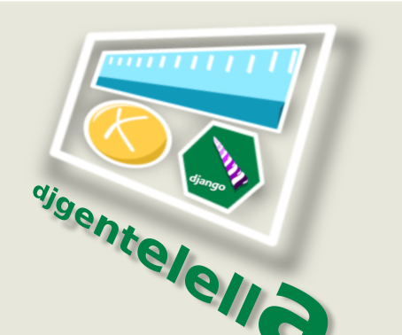

Django Gentelella Widgets
############################

.. image:: https://img.shields.io/readthedocs/django-gentelella-widgets?label=Read%20the%20Docs&logo=read%20the%20docs&logoColor=white
  :alt: Gentelella documentation

.. image:: https://img.shields.io/pypi/pyversions/django
  :alt: Gentelella supported python version

.. image:: https://github.com/Solvosoft/django-gentelella-widgets/actions/workflows/django.yml/badge.svg
  :alt: Gentelella test status

Build beautiful Django applications faster with **djgentelella** — a comprehensive widget and utility library that seamlessly integrates Bootstrap 5 with popular JavaScript libraries into Django's form system.

Stop writing repetitive frontend code. Django Gentelella Widgets provides 40+ production-ready form widgets, a complete CRUD system with permissions, and enterprise features like soft-delete, audit logging, and chunked file uploads — all styled with the elegant `Gentelella <https://colorlib.com/polygon/gentelella/index.html>`_ admin theme.

Why Django Gentelella Widgets?
________________________________

**For Developers Who Value Their Time**

- **Drop-in widgets** — Replace Django's basic form widgets with rich, interactive components. Select2 autocomplete, date range pickers, WYSIWYG editors, and more work out of the box.
- **Multiple form layouts** — Render forms as horizontal, inline, grid, or plain layouts with a single method call (``form.as_horizontal()``, ``form.as_grid()``).
- **Complete CRUD views** — Build admin interfaces in minutes with permission-aware list, create, update, and delete views.

**For Applications That Need to Scale**

- **Soft delete & trash** — Never lose data accidentally. Deleted records go to trash and can be restored.
- **Audit trail** — Track every change with automatic history logging including who changed what and when.
- **Chunked file uploads** — Handle large files reliably with resumable uploads and progress tracking.
- **Field-level encryption** — Protect sensitive data with AES encryption at the database level.

**For Teams Building Modern Web Apps**

- **REST API ready** — Built-in Django REST Framework serializers for notifications, history, and trash.
- **Real-time notifications** — User notification system with WebSocket support via Django Channels.
- **Digital signatures** — Integrate document signing workflows into your application.
- **Permission management** — Organize and assign permissions by category with a visual interface.

Key Features
______________

**Form Widgets**

- Text inputs with masks (email, phone, credit card, tax ID)
- Date/time pickers with range selection
- Select2-powered dropdowns with autocomplete and remote data
- Tree selectors for hierarchical data
- File uploads with chunking and media recording (image, video, audio)
- WYSIWYG and TinyMCE rich text editors
- Interactive components: calendars, timelines, story maps, charts
- Digital signature capture

**Application Components**

- **CRUD System** — Generic views with filtering, pagination, search, and inline editing
- **Notification System** — Categorized user notifications with REST API
- **Trash System** — Soft delete with restore capability
- **History System** — Automatic audit logging of all changes
- **Permission Management** — Visual permission assignment by group and user
- **Menu System** — Dynamic, permission-aware navigation menus
- **Blog Module** — Full-featured blog with categories and SEO sitemaps

**Frontend Libraries Included**

Bootstrap 5, Select2, DataTables, Chart.js, FullCalendar, DateRangePicker, HTMX, SweetAlert2, TinyMCE, and more — all bundled and ready to use

Documentation
________________

See `Documentation <https://django-gentelella-widgets.readthedocs.io/>`_

Installation
________________

Installing from pypi

.. code:: bash

   pip install djgentelella

Configure your settings

.. code:: bash

    INSTALLED_APPS = [ ..
        'djgentelella',
        'rest_framework',
        'markitup',
    ]
    MARKITUP_FILTER = ('markdown.markdown', {'safe_mode': True})
    MARKITUP_SET = 'markitup/sets/markdown/'
    JQUERY_URL = None

Run migrations

.. code:: bash

    python manage.py migrate

Create statics files downloading from internet (you need to install requests for this step).

.. code:: bash

     pip install requests
     python manage.py loaddevstatic

Add djgentelella urls in your project urls.py file

.. code:: bash

    from djgentelella.urls import urlpatterns as djgentelellaurls

    urlpatterns = djgentelellaurls + [
                    ...
                  ]

Usage
_________

In forms

.. code:: python

    from djgentelella.forms.forms import GTForm
    from djgentelella.widgets import core as genwidgets

    class myform(GTForm, forms.ModelForm):
        class Meta:
            model = MyObject
            fields = '__all__'
            widgets = {
                'name': genwidgets.TextInput,
                'borddate': genwidgets.DateInput,
                'email': genwidgets.EmailMaskInput
            }

In templates working with forms

.. code:: html

     {{ form.as_plain }}
     {{ form.as_inline }}
     {{ form.as_horizontal }}

In templates using base template

.. code:: html

    

Take a look this file to note the template block that you can overwrite

Test
__________

To run the all test use:

.. code:: bash

    cd demo
    python manage.py test

To run the responsive test use:

.. code:: bash

    cd demo
    python manage.py test demoapp.tests.selenium.responsive

Run the demo
---------------

.. code:: bash

    cd demo
    python manage.py migrate
    python manage.py createdemo
    python manage.py demomenu

And More see demo app.

Run the demo with Makefile
-----------------------------

.. code:: bash

    make init_demo

Notes for development
____________________________

`base.js` is autogenerated so you need to call

.. code:: bash

    python manage.py createbasejs

Remember update the package version before make deploy it on server.

Translation
____________________________

To add a new translation for a word there are two options:

.. code:: bash

    django-admin makemessages --all

This command adds words that are inside django templates to ``locale/es/LC_MESSAGES/django.po``, there these words can be translated.

To add a word you can use the following syntax.

.. code:: html

    

For words used in JavaScript files, the following command must be executed.

.. code:: bash

    django-admin makemessages -d djangojs -l es  --ignore *.min.js

This command adds words that are inside the ``gettext`` js function, to ``locale/es/LC_MESSAGES/djangojs.po``, there these words can be translated.

Here is an example of ``gettext`` implementation:

.. code:: js

    alert(gettext("new_word"))

Notes for releases
____________________________

To fix use vendors files need to update the line 53

.. code:: python

    await asyncio.wait(map(lambda runner: asyncio.create_task(runner.future), running))

in the root ``{venv}/lib/python3.11/site-packages/pylp/cli/run.py``.
