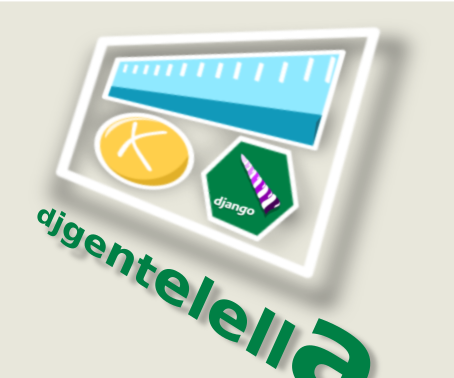

Django Gentelella widgets
############################

.. image:: https://img.shields.io/readthedocs/django-gentelella-widgets?label=Read%20the%20Docs&logo=read%20the%20docs&logoColor=white
  :alt: Gentelella documentation

.. image:: https://img.shields.io/pypi/pyversions/django
  :alt: Gentelella supported python version

.. image:: https://github.com/Solvosoft/django-gentelella-widgets/actions/workflows/django.yml/badge.svg
  :alt: Gentelella test status

This application is a set of utilities that will make developing applications with django and bootstrap 5 easier, as it provides a set of Javascript libraries such as select2, icheck, datatables and more nicely integrated as widgets or utilities that simplify application creation.

This app helps you to integrate Django apps with `Gentelella <https://colorlib.com/polygon/gentelella/index.html>`_ building extra widgets for forms and speciall methods to render forms in templates.

Documentation
________________

See `Documentation <https://django-gentelella-widgets.readthedocs.io/>`_

Installation
________________

Installing from pypi

.. code:: bash

   pip install djgentelella

Configure your settings

.. code:: bash

    INSTALLED_APPS = [ ..
        'djgentelella',
        'rest_framework',
        'markitup',
    ]
    MARKITUP_FILTER = ('markdown.markdown', {'safe_mode': True})
    MARKITUP_SET = 'markitup/sets/markdown/'
    JQUERY_URL = None

Run migrations

.. code:: bash

    python manage.py migrate

Create statics files downloading from internet (you need to install requests for this step).

.. code:: bash

     pip install requests
     python manage.py loaddevstatic

Add djgentelella urls in your project urls.py file

.. code:: bash

    from djgentelella.urls import urlpatterns as djgentelellaurls

    urlpatterns = djgentelellaurls + [
                    ...
                  ]

Usage
_________

In forms

.. code:: python

    from djgentelella.forms.forms import GTForm
    from djgentelella.widgets import core as genwidgets

    class myform(GTForm, forms.ModelForm):
        class Meta:
            model = MyObject
            fields = '__all__'
            widgets = {
                'name': genwidgets.TextInput,
                'borddate': genwidgets.DateInput,
                'email': genwidgets.EmailMaskInput
            }

In templates working with forms

.. code:: html

     {{ form.as_plain }}
     {{ form.as_inline }}
     {{ form.as_horizontal }}

In templates using base template

.. code:: html

    

Take a look this file to note the template block that you can overwrite

Test
__________

To run the all test use:

.. code:: bash

    cd demo
    python manage.py test

To run the responsive test use:

.. code:: bash

    cd demo
    python manage.py test demoapp.tests.selenium.responsive

Run the demo
---------------

.. code:: bash

    cd demo
    python manage.py migrate
    python manage.py createdemo
    python manage.py demomenu

And More see demo app.

Run the demo with Makefile
-----------------------------

.. code:: bash

    make init_demo

Notes for development
____________________________

`base.js` is autogenerated so you need to call

.. code:: bash

    python manage.py createbasejs

Remember update the package version before make deploy it on server.

Translation
____________________________

To add a new translation for a word there are two options:

.. code:: bash

    django-admin makemessages --all

This command adds words that are inside django templates to ``locale/es/LC_MESSAGES/django.po``, there these words can be translated.

To add a word you can use the following syntax.

.. code:: html

    

For words used in JavaScript files, the following command must be executed.

.. code:: bash

    django-admin makemessages -d djangojs -l es  --ignore *.min.js

This command adds words that are inside the ``gettext`` js function, to ``locale/es/LC_MESSAGES/djangojs.po``, there these words can be translated.

Here is an example of ``gettext`` implementation:

.. code:: js

    alert(gettext("new_word"))

Notes for releases
____________________________

To fix use vendors files need to update the line 53

.. code:: python

    await asyncio.wait(map(lambda runner: asyncio.create_task(runner.future), running))

in the root ``{venv}/lib/python3.11/site-packages/pylp/cli/run.py``.
