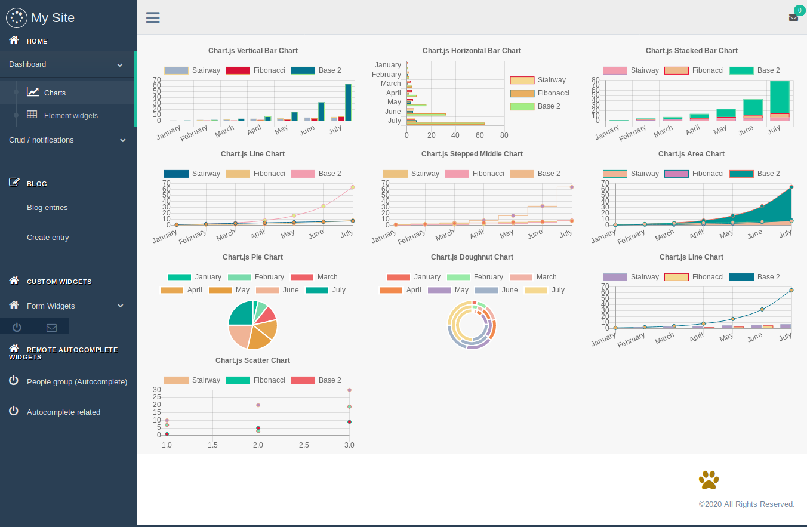

Chart Widget
^^^^^^^^^^^^^^^

You can register automatically chart widgets api creating a `gtcharts.py` in your app,
djgentelella look for charts view for all apps in INSTALLED_APP.

This app use Chartjs for build chart, you need to provide the right structure in the dataset,
for examples see  `here <https://www.chartjs.org/samples/latest/>`_

.. code:: python

    from djgentelella.groute import register_lookups

    @register_lookups(prefix="verticalbar", basename="verticalbar")
    class VerticalBarChartExample(BaseChart, VerticalBarChart):

           def get_labels(self):
                return [...]
           def get_def get_datasets(self):
                return ...
           def get_title(self):
                return {'display': True,
                        'text': 'Chart.js Example'
                        }

You can use `@register_lookups` in any part of your code, but remember to import it on url.py,
and set your app before 'djgentelella'. Also `prefix` and `basename` needs to be unique.

To show in templates you can use this snippet:

.. code:: html

    

        

        
        

    

To build url you can use

.. code:: python

    from django.urls import reverse
    context_url_variable = reverse(verticalbar-list)

.. note:: To build the url you need to append list to basename like <basename>-list

Available Charts
-------------------

- VerticalBarChart
- HorizontalBarChart
- StackedBarChart
- LineChart
- PieChart
- DoughnutChart
- ScatterChart

.. note:: Pie and Doughnut have different way to build datasets, see chartjs documentation for more.

Chart Options
-------------------

You can build your own options overwritting this methods.

- get_responsive
- get_legend
- get_title
- get_tooltips
- get_hover
- get_scales
- get_elements
- get_animation

You can overwrite JS callbacks adding your function on `document.chartcallbacks` with a name,and register that name on server side as callback field
now only `options.tooltips.callbacks.beforeLabel` and `options.tooltips.callbacks.label` callbacks are supported.

