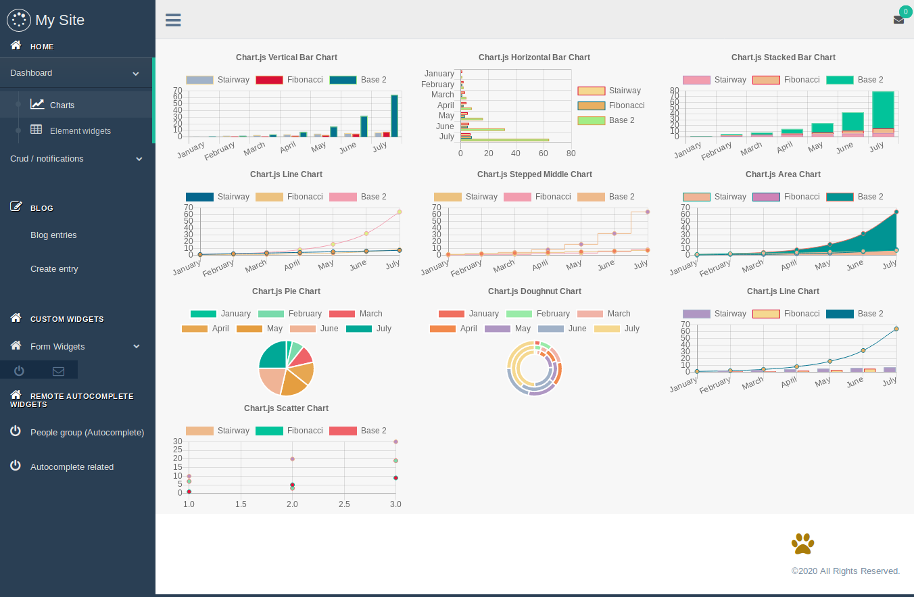

Chart Widget
^^^^^^^^^^^^^^^

You can register automatically chart widgets api creating a `gtcharts.py` in your app,
djgentelella look for charts view for all apps in INSTALLED_APP.

This app use Chartjs for build chart, you need to provide the right structure in the dataset,
for examples see  `here <https://www.chartjs.org/samples/latest/>`_

.. code:: python

    from djgentelella.groute import register_lookups

    @register_lookups(prefix="verticalbar", basename="verticalbar")
    class VerticalBarChartExample(BaseChart, VerticalBarChart):

           def get_labels(self):
                return [...]
           def get_def get_datasets(self):
                return ...
           def get_title(self):
                return {'display': True,
                        'text': 'Chart.js Example'
                        }

You can use `@register_lookups` in any part of your code, but remember to import it on url.py,
and set your app before 'djgentelella'. Also `prefix` and `basename` needs to be unique.

To show in templates you can use this snippet:

.. code:: html

    

        

        
        

    

To build url you can use

.. code:: python

    from django.urls import reverse
    context_url_variable = reverse(verticalbar-list)

.. note:: To build the url you need to append list to basename like <basename>-list

Available Charts
-------------------

- VerticalBarChart
- HorizontalBarChart
- StackedBarChart
- LineChart
- PieChart
- DoughnutChart
- ScatterChart

.. note:: Pie and Doughnut have different way to build datasets, see chartjs documentation for more.

Chart Options
-------------------

You can build your own options overwritting this methods.

- get_responsive
- get_maintainAspectRatio
- get_indexAxis
- get_legend
- get_title
- get_tooltips
- get_hover
- get_scales
- get_elements
- get_animation
- get_plugins

Each one returns the value of the option it names, and ``get_options`` puts it
where Chart.js expects it. ``get_title``, ``get_legend`` and ``get_tooltips``
end up under ``options.plugins`` (as ``title``, ``legend`` and ``tooltip``),
which is where Chart.js 3 moved them; ``get_plugins`` is for any other plugin,
including third party ones, and is merged with the three above.

Scales are a dict keyed by axis name, not the two lists of Chart.js 2::

    def get_scales(self):
        return {'x': {'stacked': True},
                'y': {'stacked': True,
                      'title': {'display': True, 'text': 'units'}}}

Chart.js 4 vocabulary
~~~~~~~~~~~~~~~~~~~~~~~

This library moved from Chart.js 2 to Chart.js 4, which renamed a good part of
the configuration. If you are porting charts written for the old release:

===============================  ==========================================
Chart.js 2                       Chart.js 4
===============================  ==========================================
``options.title``                ``options.plugins.title``
``options.legend``               ``options.plugins.legend``
``options.tooltips``             ``options.plugins.tooltip``
``scales.xAxes: [{...}]``        ``scales: {x: {...}}``
``scale.scaleLabel.labelString`` ``scale.title.text``
``scale.gridLines``              ``scale.grid``
``elements.rectangle``           ``elements.bar``
``dataset.steppedLine``          ``dataset.stepped``
``type: 'horizontalBar'``        ``type: 'bar'`` + ``indexAxis: 'y'``
===============================  ==========================================

The getter names did not change, and the last five rows are translated for you:
a ``get_scales`` still returning ``xAxes``/``yAxes``, an ``elements.rectangle``
block, a ``steppedLine`` dataset key and a ``get_type`` returning
``horizontalBar`` all keep working. Treat that as a grace period, not as the
supported vocabulary.

Tooltip callbacks
~~~~~~~~~~~~~~~~~~~

A callback cannot travel as JSON, so the server sends its *name* and the browser
looks it up in ``document.chartcallbacks``::

    document.chartcallbacks.mylabel = function (context) {
        return context.dataset.label + ': ' + context.parsed;
    }

.. code:: python

    def get_tooltips(self):
        return {'callbacks': {'label': 'mylabel'}}

``label``, ``beforeLabel``, ``afterLabel``, ``title`` and ``footer`` are looked
up this way. Chart.js 3 replaced the old ``(item, data)`` arguments with a
single tooltip context object, so a callback written for Chart.js 2 has to be
updated.

