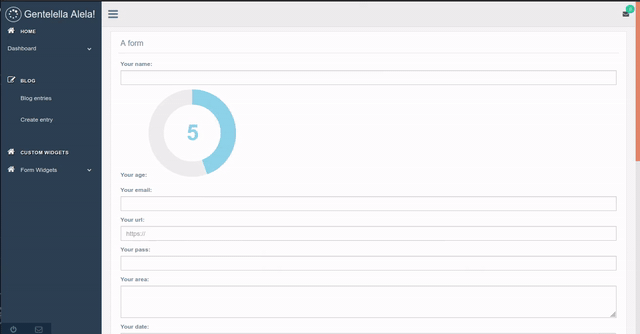

Pallete widget
^^^^^^^^^^^^^^^^

It is a kind of helper, that is located at the bottom left-hand side corner, with a mail icon.
This widget is used to add a description for each input field in the different displayed forms
of the views. When we hit the mail icon the helper modal is displayed.

The help button appears at the left side of the label for each input field
as a question mark, when we hit the show button in the helper modal.

We can see, add, modify, and delete descriptions for each field.

**How to add this widget ??**

You must create MenuItem as follow:

*Note: the only place in which this widget can be place is in the sidebar footer.*

.. code:: python

   item = MenuItem.objects.create(
       parent = None,
       title = '',
       url_name ='djgentelella.menu_widgets.palette.PalleteWidget', #path to the widget file
       category = 'sidebarfooter', # the only place in which this widget can be place
       is_reversed = False,
       reversed_kwargs = None,
       reversed_args = None,
       is_widget = True, # must be set to true as exist other kind of element
       icon = 'fa fa-envelope-o', # you can use fontawesome icons
       only_icon = True # this flag must be True
   )

