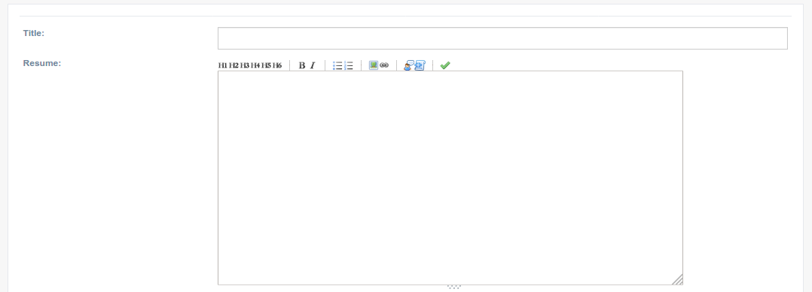
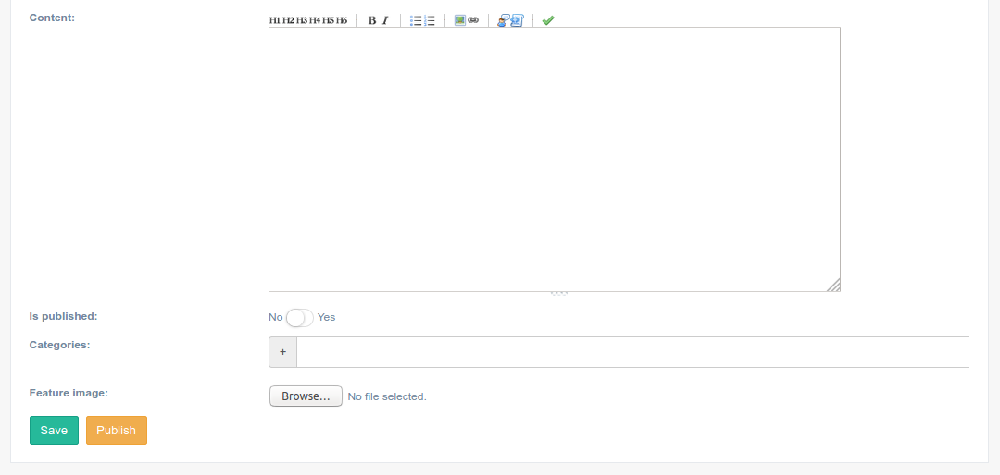

===============
Blog app
===============

**How to install this app??**

To install this app first you need to add 'djgentelella.blog' to INSTALLED_APPS in the settings file.
Then you must add urls to urls.py as follow:

.. code:: python

   urlpatterns = [
       path('blog/', include('djgentelella.blog.urls'))
   ]

.. code:: python

   blog = MenuItem.objects.create(
       parent = None,
       title = 'Blog',
       url_name ='/',
       category = 'sidebar',  #sidebar, sidebarfooter,
       is_reversed = False,
       reversed_kwargs = None,
       reversed_args = None,
       is_widget = False,
       icon = 'fa fa-edit',
       only_icon = False
   )

You can also add an element to add new entries to the blog.

.. code:: python

   blogentry = MenuItem.objects.create(
       parent = blog,
       title = 'Blog entries',
       url_name ='blog:entrylist',
       category = 'sidebar',  #sidebar, sidebarfooter,
       is_reversed = True,
       reversed_kwargs = None,
       reversed_args = None,
       is_widget = False,
       icon = 'fa fa-build',
       only_icon = False
   )

This element redirect to the entry list view of the blog app.

You can also add an elements to add new entries to the blog.

.. code:: python

   blogentry = MenuItem.objects.create(
       parent = blog,
       title = 'Create  entry',
       url_name ='blog:entrycreate',
       category = 'sidebar',  #sidebar, sidebarfooter,
       is_reversed = True,
       reversed_kwargs = None,
       reversed_args = None,
       is_widget = False,
       icon = 'fa fa-build',
       only_icon = False
   )

