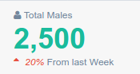
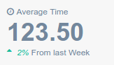
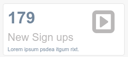
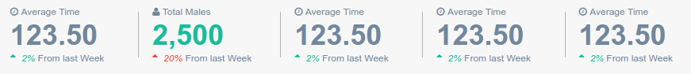
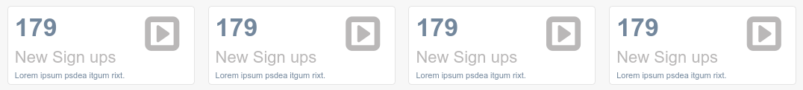

==================
Elements Object
==================

This object is used to display an indicator with different labels, icons and values.

You can create your own indicator inheriting from **StartsElement** or **BoxTileElement** class,
then you must implement all methods.

.. code:: python

   class MemberStats(StatsElement):
       def get_top_icon(self):
           return "fa fa-user"
       def get_top_text(self):
           return " Total Males"
       def get_count(self):
           return "2,500"

       def get_count_color(self):
           return 'green'

       def get_bottom_color(self):
           return "red"

       def get_bottom_text(self):
           return "From last Week"

       def get_bottom_icon(self):
           return "fa fa-sort-asc"

       def get_bottom_icon_text(self):
           return "20%"

.. code:: python

   class ClockTime(StatsElement):

       def get_top_icon(self):
           return "fa fa-clock-o"

       def get_top_text(self):
           return "Average Time"

       def get_count(self):
           return "123.50"

       def get_bottom_icon_text(self):
           return "2%"

       def get_bottom_color(self):
           return "green"

       def get_bottom_text(self):
           return "From last Week"

       def get_bottom_icon(self):
           return "fa fa-sort-asc"

.. code:: python

   class SignupsBox(BoxTileElement):
       def get_icon(self):
           return "fa fa-caret-square-o-right"
       def get_number(self):
           return "179"
       def get_title(self):
           return "New Sign ups"
       def get_subtitle(self):
           return "Lorem ipsum psdea itgum rixt."

Exist a **StatsCountList** class used to display **StartsElement** in a row, and many elements as we want

.. code:: python

   class StatsCountListExample(StatsCountList):
       stats_views = [ClockTime, MemberStats, ClockTime, ClockTime]

Exist a **BoxStatsCountList** class for the same purpose but to display **BoxTileElement**

.. code:: python

   class BoxTileElementExample(BoxStatsCountList):
       stats_views = [SignupsBox, SignupsBox, SignupsBox,SignupsBox ]

