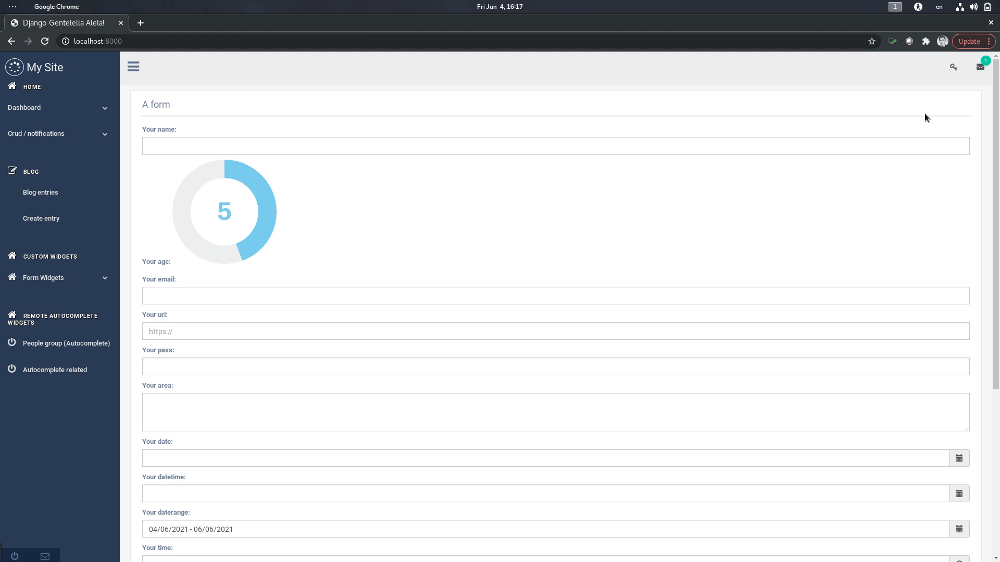
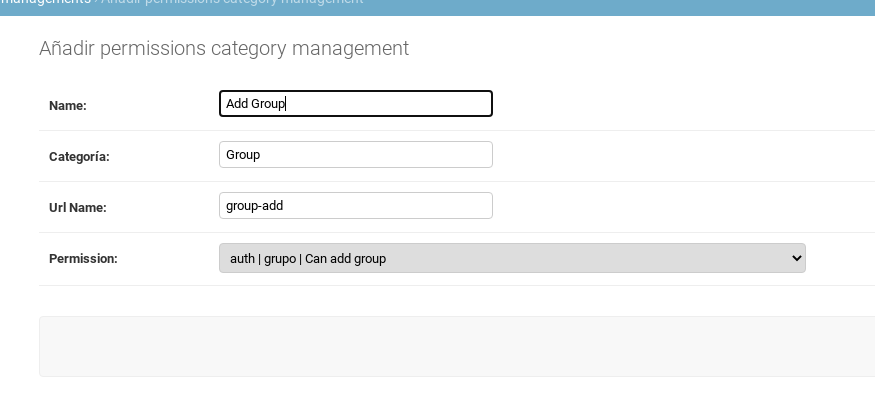

======================
Permission Management
======================

This feature allow as to manage permissions per view, so we can asociate an
specific url name with an specific permission codename and permission category.

---------------------
 Live Demo
---------------------

You can use two main approches to achieve this:
   - Use `get_or_create_permission_context`.
   - Create the permission manually.

--------------------------
Define programatically.
--------------------------

1. You must create a `pre_head` block as the following example in your template:

.. code-block:: python

   
      
      
   

The parameters in here are the following:
   - `urlname`: Can be a list serparated by commas
   - `appname`: This is 78 name of the app asocciated with the permission.
   - `codename`: Can be a list of django codenames that are associated with the urlnames.
   - `humanname` Is a list names related to the code names this names will be display to the user.
   - `category`: Is the name that will join differents permissions together.

Make sure that `urlname`, `codename` and `humanname` has the same number of elements.

It is possible to define also:

.. code-block:: python

   
      
      
   

So we can define a list of permissions in the template tag.

If you want to keep your code clearly:

.. code-block:: python

   
      
      
      
   

The default behavior of the djgentellela is that if you are superadmin will display de button
to manage the permissions similar to the Live Demo.

If you want to change the permissions you can override the following partial `gentelella/app/top_navigation.html` and
also in `gentelella/base.html`

-------------------------------
Define permissions manually
-------------------------------

To do this you have to go to the admin panel and go to gentellella app:

.. image:: ./_static/02-permissionmanagement-admin.png

The we can create a new permission as the following example:

And in your view because you created the permission manually just need to create in your template the following:

.. code-block:: python

   
      
   

It's really important that you define all the context in the `pre_head` block otherwise it will not work.

-----------------------------------------
Use different model that User and Group
-----------------------------------------

To use different User model you have to add to your settings.py the following:

.. code-block:: python

   GT_USER_MODEL = 'demoapp.Employee'

And your custom model need to implement the following function:

.. code-block:: python

   class Employee(models.Model):
      user = models.ForeignKey(User, on_delete=models.CASCADE)
      username = models.CharField(max_length=100)

      #username also can be a @property to user.username.

      @property
      def gt_get_permission(self):
         return self.user.user_permissions

      def __str__(self):
         return self.username

You need a `gt_get_permission` method that return the relative relation to permissions model.
Make sure that you have the `username` field that can be a `CharField` or a `@property` in this way
djgentellela will display all the information properly.

To use different Group model you have to add to your settings.py the following:

.. code-block:: python

   GT_GROUP_MODEL = 'demoapp.Employee'

And your custom model has to be like the following:

.. code-block:: python

   class PermissionsGroup(models.Model):
      name = models.CharField(max_length=150)
      department = models.ForeignKey(Department, on_delete=models.CASCADE)
      permission = models.ManyToManyField(PermissionDescription, blank=True)
      users = models.ManyToManyField(User, blank=True)

      @property
      def gt_get_permission(self):
         return self.permission

Make suere you have the `gt_get_permission` and the `name` field that also of course can be a `@property`.

-----------------------------------------
Decorators
-----------------------------------------

This decorators have 2 optionals parameters

1) login_url=None    Same as `login_url` of the django decorator `login_required`
2) raise_exception=False  Same as `raise_exception` of the django decorator `login_required`

You can use like:

.. code-block:: python

    from djgentelella.decorators.perms import any_permission_required
    @any_permission_required(['djgentelella.view_gentelellasettings' 'auth.view_user'],
    login_url='/your/url', raise_exception=True
    )
    def myview(request, *args, **kwargs):
        # do your view

''''''''''''''''''''''''''''''''
any_permission_required
''''''''''''''''''''''''''''''''

Decorator for views that checks whether user has any permission
enabled in perms list, redirecting to the log-in page if necessary.
If the raise_exception parameter is given the PermissionDenied exception
is raised.

.. code-block:: python

    from djgentelella.decorators.perms import any_permission_required

    @any_permission_required(['djgentelella.view_gentelellasettings' 'auth.view_user'])
    def myview(request, *args, **kwargs):
        # do your view

''''''''''''''''''''''''''''
all_permission_required
''''''''''''''''''''''''''''

Decorator for views that checks whether a user has all permission
enabled in perms list, redirecting to the log-in page if necessary.
If the raise_exception parameter is given the PermissionDenied exception
is raised.

.. code-block:: python

    from djgentelella.decorators.perms import all_permission_required
    @all_permission_required(['djgentelella.view_gentelellasettings' 'auth.view_user'])
    def myview(request, *args, **kwargs):
        # do your view

-----------------------------------------
TemplateTags
-----------------------------------------

''''''''''''''''''''''''''''''
any_permission_required
''''''''''''''''''''''''''''''

This template tag check if the user have any permission in the list of perms

Example:

.. code-block:: html

    
    
    
    
     djgentelella.view_gentelellasettings <strong class="text-danger">OR</strong> auth.view_user allowed
    

''''''''''''''''''''''''''''''
all_permission_required
''''''''''''''''''''''''''''''

This template tag check if the user have all permissions in the list of perms

.. code-block:: html

    
    
    
    
    
     djgentelella.view_gentelellasettings <strong class="text-danger">AND</strong> auth.view_user are allowed
    
    

Happy coding.

--------------------------
Related Permissions API.
--------------------------
This API integrates with Django Rest Framework (DRF) and is used to retrieve permission details.

--------------------------
API Usage.
--------------------------
To use this API, make a GET request to the API URL with the ID of the desired primary permission.
The API will respond with the details of the related permissions associated with that parent permission.
For example, in your browser you should type http://127.0.0.1:8722/permsrelated/102/

http://127.0.0.1:8722: your localhost
permsrelated: this is the url of the api
/102/: This is the ID of the permit you want to search for

--------------------------
Models.
--------------------------

PermissionModelRelated
This model represents the
relationship between a parent permission and several related permissions. Key fields include:

main_permission: A ForeignKey field that references the main permission.
related_permissions: A ManyToMany field that stores a list of permissions related to the parent permission.

--------------------------
Viewset.
--------------------------
PermissionRelatedDetailView
The PermissionRelatedDetailView is a DRF class-based view that allows you to retrieve details of a PermissionRelated object based on its ID. It works in the following way:

It uses DRF's generics.RetrieveAPIView class as a base.
The queryset property defines the set of available PermissionRelated objects.
The PermissionRelatedSerializer serializer is used to serialize the data before sending it as a response.
The get_object function retrieves a PermissionRelated object based on the ID provided in the URL.

--------------------------
Serializer.
--------------------------

PermissionRelatedSerializer
The PermissionRelatedSerializer serializer is responsible for converting PermissionRelated objects into JSON representations. Key features of the serializer include:

The related_permissions field is defined as a SerializerMethodField, allowing you to customize how related permissions are serialized.
The get_related_permissions function is used to get related permissions and their details.
A list of related permissions is created and existing permissions are removed to avoid duplicates.
The PermissionSerializer serializer is used to convert the list of related permissions into JSON data.

--------------------------
Url.
--------------------------
The API URL is defined as:
path('permsrelated/<int:permission_id>/', PermissionRelatedDetailView.as_view(), name='api_related_permissions_detail')
This URL allows you to access details of related permissions for a specific parent permission.
You must provide the primary permission ID in the URL to retrieve the relevant information.

--------------------------
Manage Permissions
--------------------------
This code is used to manage permissions and related permissions in a Django application.
Allows you to add, delete, and update related permissions based on a predefined set of data.

--------------------------
Definition of permissions in a dictionary and functions
--------------------------

The code starts with a list of dictionaries called permissions_to_create.
Each dictionary represents a parent permission and its associated related permissions. Key fields in each dictionary include:

app_label: Label of the application to which the permissions belong.
main_permission_natural_name: Natural name of the main permission.
main_permission_codename: Main permission code.
related_permissions: List of related permissions,
where each related permission has its own application label (app_label), name (name), and code (codename).

--------------------------
Add Related Permissions
--------------------------
The add_related_permission function allows you to add related permissions
to an existing parent permission. It works in the following way:

Cycles through the list of predefined permissions in permissions_to_create.
Compares the supplied main_permission_codename with the main permission code on each list item.
If a matching parent permission is found,
it adds the specified related permissions to the related_permissions list.
Returns True if the related permission is successfully
added and False if the parent permission is not found.

#Example Add permissions

related_permissions = {
   'app_label': 'auth',
    'name': 'Can delete user',
    'codename': 'delete_user',
}

if add_related_permission('change_abcde', related_permissions):
    print("Related permission added successfully.")
else:
    print("Parent permission not found to add related permission.")

--------------------------
How to use the add permissions function
--------------------------
From app.py, you can import the functions defined
in permissions.py and run it to add
For the changes to take effect, developers must
call these functions in their code, and once executed,
the related permissions will be modified, added, or removed as specified in the functions.
These changes to the permissions dictionary will be
reflected in your application's permissions logic.

--------------------------
Remove related permissions
--------------------------
The remove_related_permission function allows you
to remove related permissions from an existing parent permission. It works in the following way:

Cycles through the list of predefined permissions in permissions_to_create.
Compares app_label, main_permission_codename, and related_permission_codename with the given arguments.
If a matching parent permission is found, removes the specified
related permission from the related_permissions list.
Returns True if the related permission is successfully
removed and False if the related permission is not found.

#Example delete permissions

result_remove = remove_related_permission('demoapp', 'add_abcde', 'add_session')
if result_remove:
    print("Related permission successfully removed.")
else:
   print("Related permission not found for delete.")

--------------------------
Update related permissions
--------------------------
The update_related_permission function allows you to update related
permissions of an existing parent permission. It works in the following way:

Cycles through the list of predefined permissions in permissions_to_create.
Compares app_label, main_permission_codename, and related_permission_codename with the given arguments.
If a matching parent permission is found, it finds the corresponding
related permission in the related_permissions list and updates its name and code.
Returns True if the related permission is successfully
updated and False if the related permission is not found.

# Example update permissions

result_update = update_related_permission('demoapp', 'change_abcde', 'add_user', 'Can view user', 'view_user')
if result_update:
    print("Related permission successfully updated.")
else:
    print("Related permission not found for update.")

--------------------------
Django command
--------------------------
The code also includes a custom Django command called
Command that is used to create related permissions on the database.
The command does the following:

Iterates through the permissions data in permissions_to_create.
Searches and obtains the primary permission based on its application tag, natural name, and code.
Then, it finds and obtains the related permissions based on their application tags, names, and codes.
Creates a PermissionRelated object and sets the related permissions on the object.
Saves the PermissionRelated object to the database.

This command will be executed every time the server is up, since in app.py,
this
function def ready(self) is established:
super(DjgentelellaConfig, self).ready()
logger = logging.getLogger(__name__)
logger.info("The DjgentelellaConfig application is ready.")
from django.core import management
management.call_command('show_permissions')

This allows the developer,
instead of executing the command on the command line,
to execute it when the server wakes up.

--------------------------
Related to permissions management
--------------------------
This JavaScript code allows loading related permissions from the related permissions API
loadRelatedPermissions function
The loadRelatedPermissions function is used to load the related permissions and restore the states of the checkboxes in the user interface. Below are its main features:

Parameters:
permissionId: The ID of the parent permission from which to load related permissions.
internalCheckboxes: The container for internal checkboxes where related permissions will be displayed.
Functioning:

Make a GET request to a specific API URL to get the related permissions from the parent permission.
Check if related permissions exist in the response.
If related permissions exist, generate the necessary HTML to display the check boxes for the related permissions.
Initialize the iCheck plugin for related permissions.
Adds ifChecked and ifUnchecked events to the related permission checkboxes.
If there are no related permissions, displays a message
indicating that there are no related permissions available.

