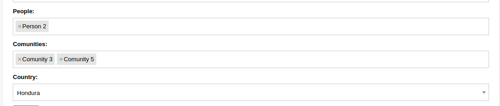

AutoCompleteSelect and AutocompleteSelectMultiple widgets
^^^^^^^^^^^^^^^^^^^^^^^^^^^^^^^^^^^^^^^^^^^^^^^^^^^^^^^^^^^

2 requirements must be achieved to use these widgets

- Create a lookup channel in ``app/gtselects.py`` based in the model we want to use as options in the widget.
- Replace default widget in form with ``AutocompleteSelect`` or ``AutocompleteSelectMultiple``.

-------------------------------------
Defining Lookups for usage in widgets
-------------------------------------
An example on how a lookup must be defined:

.. code:: python

    from djgentelella.groute import register_lookups
    from djgentelella.views.select2autocomplete import BaseSelect2View
    from yourapp.models import models

    @register_lookups(prefix="person", basename="personbasename")
    class PersonGModelLookup(BaseSelect2View):
        model = models.Person
        fields = ['name']

Based in above example we need:

- A decorator named register_lookups defined above the lookup class that receives two parameters:
    - A prefix, which is basically the model name in lowcaps
    - A basename, which is a meaningful name that will help you differentiate between multiple lookups
- A class that inherits from the custom class BaseSelect2View which is responsible of creating an url that exposes the model data in a way the widget urderstands it, so to make it works the class needs:
    - A model to work with.
    - A list of fields from the model that the inherited class will use as filtering options when returning data to the widget.

If a more customized class is desired the next options can be overwritten to achieve it:

 - ref_field: can be used to select a specific field from the model with a list behavior (manytomanyfield or fields with choices) and use it to filter options.
 - ref_name: combined with ref_field, this field receives a list of strings that will be evaluated if any of its elements is contained in the ref_field field.
 - text_separator:  if provided, the class will use it to generate a list separated with the given value from result data.
 - text_wrapper: if provided, the class will wrap each element of the result query with the value given.
 - order_by: if provided, the class will used the given field to order the result query, the default field is the model pk.

-----------------
Usage in forms
-----------------

In model based form:

.. code:: python

    from djgentelella.widgets.selects import AutocompleteSelect, AutocompleteSelectMultiple
    from djgentelella.forms.forms import GTForm
    class PeopleGroupForm(GTForm, forms.ModelForm):
        class Meta:
            model = models.PeopleGroup
            fields = '__all__'
            widgets = {
                'name': TextInput,
                'people': AutocompleteSelectMultiple("personbasename"),
                'comunities': AutocompleteSelectMultiple("comunitybasename"),
                'country': AutocompleteSelect('countrybasename')
            }

As noticed in above example, the last steps are:
 - Replace the default widget with ``AutocompleteSelect`` or ``AutocompleteSelectMultiple`` (this may vary depending of the kind of form used).
 - Send the basename we provided in the lookup class decorator (see previous example) to the widget and it's ready for usage!

----------------------
Widget inside modals
----------------------

Select2 has problems for deal with forms inside modals, but it has an attribute to work with modals, so you can add `data-dropdownparent` as attr
for example

.. code:: html

    

        

           {{form.has_horizontal}}
        

    

in forms.py

.. code:: python

    class Meta:
      widgets={
        'comunities': AutocompleteSelectMultiple("comunitybasename", attrs={'data-dropdownparent': '#exampleModal'}),
      }

----------------------
Selects groups
----------------------
Using `attrs` you can autocomplete options based on others select2,  to do that just set `data-related` as `True`, add
the groupname `data-groupname`, this need to be shared by all select on group, and add the position order `data-pos`,
this needs to be in ascending order number, is used to know who is the next select when one select is changed, so you
need to be sure that numbers don't repeat and are in order.

.. code:: python

    class ABCDEGroupForm(GTForm, forms.ModelForm):
      class Meta:
        model = models.ABCDE
        fields = '__all__'
        widgets = {
            'a': AutocompleteSelectMultiple("a", attrs={
                'data-related': 'true',
                'data-pos': 0,
                'data-groupname': 'myabcde'
            }),
            'b': AutocompleteSelect("b", attrs={
                'data-related': 'true',
                'data-pos': 1,
                'data-groupname': 'myabcde'
            }),

In your app  `gtselects.py` set the `ref_field` to indicate what field use to lookup on queryset.

.. code:: python

    @register_lookups(prefix="b", basename="b")
    class BLookup(BaseSelect2View):
        model = models.B
        fields = ['display']
        ref_field = 'a'

----------------------
Customs Urls
----------------------
In some cases you need to pass more data to reverse url, by default `-list` is appended to the base url name, but you
can change it for something like `-detail` and pass some data like pk, ej.

in forms.py

.. code:: python

    class Meta:
      widgets={
        'comunities': AutocompleteSelectMultiple("comunitybasename",
                        url_suffix='-detail', url_args=[], url_kwargs={'pk': 1}, }),
      }

.. note:: the reverse url happen on `get_context(self, name, value, attrs)` method.

There is some cases when you don't have the values on compilation moment, so you can overwrite
`extra_url_args` and `extra_url_kwargs` in widget instance before form render

.. code:: python

    class Myform(GTForm):
        def __init__(self, *args, **kwargs):
            super().__init__(*args, **kwargs)
            self.fields['comunities'].widget.extra_url_kwargs['pk']=1

        class Meta:
            widgets={
              'comunities': AutocompleteSelectMultiple("comunitybasename", url_suffix='-detail'),
            }

-------------------------------------
Filter based on inputs inside page
-------------------------------------
It's posible to use other inputs included on the search criteria, using `attr` attribute you can inject html data atributes
that start with `data-s2filter-`, next the name of the search criteria esperated on backend like  `data-s2filter-myinput`,
the value it has the html selector on the page.

.. code:: python

    class PeopleGroupForm(CustomForm, forms.ModelForm):
        class Meta:
            model = models.PeopleGroup
            fields = '__all__'
            widgets = {
                'name': TextInput,
                'people': AutocompleteSelectMultiple("personbasename",
                                                     attrs={
                                                         'data-s2filter-myinput': '#id_name'}),
                }

