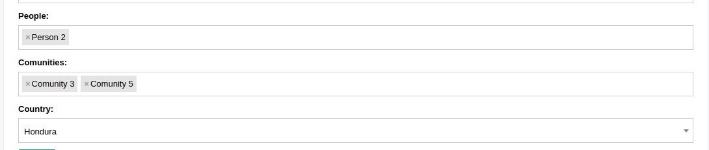

AutoCompleteSelect and AutocompleteSelectMultiple widgets
^^^^^^^^^^^^^^^^^^^^^^^^^^^^^^^^^^^^^^^^^^^^^^^^^^^^^^^^^^^

2 requirements must be achieved to use these widgets

- Create a lookup channel in ``app/gtselects.py`` based in the model we want to use as options in the widget.
- Replace default widget in form with ``AutocompleteSelect`` or ``AutocompleteSelectMultiple``.

-------------------------------------
Defining Lookups for usage in widgets
-------------------------------------
An example on how a lookup must be defined:

.. code:: python

    from djgentelella.groute import register_lookups
    from djgentelella.views.select2autocomplete import BaseSelect2View
    from yourapp.models import models

    @register_lookups(prefix="person", basename="personbasename")
    class PersonGModelLookup(BaseSelect2View):
        model = models.Person
        fields = ['name']

Based in above example we need:

- A decorator named register_lookups defined above the lookup class that receives two parameters:
    - A prefix, which is basically the model name in lowcaps
    - A basename, which is a meaningful name that will help you differentiate between multiple lookups
- A class that inherits from the custom class BaseSelect2View which is responsible of creating an url that exposes the model data in a way the widget urderstands it, so to make it works the class needs:
    - A model to work with.
    - A list of fields from the model that the inherited class will use as filtering options when returning data to the widget.

If a more customized class is desired the next options can be overwritten to achieve it:

 - ref_field: name of the model field used to filter the queryset against the value of the previous select in a chain (see `Selects groups`_). When it is set and the parent select is empty the queryset is ``none()``, so the child dropdown comes up empty on purpose.
 - ref_name: the name of the GET parameter carrying that parent value, ``'relfield'`` by default. Change it only if your endpoint expects another name.
 - exclude_selected: ``False`` by default. When ``True`` the rows the widget says it already holds are dropped from the answer instead of being returned flagged (see `Hiding the chosen options`_).
 - text_separator:  if provided, the class will use it to generate a list separated with the given value from result data.
 - text_wrapper: if provided, the class will wrap each element of the result query with the value given.
 - order_by: if provided, the class will used the given field to order the result query, the default field is the model pk.

-----------------
Usage in forms
-----------------

In model based form:

.. code:: python

    from djgentelella.widgets.selects import AutocompleteSelect, AutocompleteSelectMultiple
    from djgentelella.forms.forms import GTForm
    class PeopleGroupForm(GTForm, forms.ModelForm):
        class Meta:
            model = models.PeopleGroup
            fields = '__all__'
            widgets = {
                'name': TextInput,
                'people': AutocompleteSelectMultiple("personbasename"),
                'comunities': AutocompleteSelectMultiple("comunitybasename"),
                'country': AutocompleteSelect('countrybasename')
            }

As noticed in above example, the last steps are:
 - Replace the default widget with ``AutocompleteSelect`` or ``AutocompleteSelectMultiple`` (this may vary depending of the kind of form used).
 - Send the basename we provided in the lookup class decorator (see previous example) to the widget and it's ready for usage!

----------------------
Widget inside modals
----------------------

Select2 has problems for deal with forms inside modals, but it has an attribute to work with modals, so you can add `data-dropdownparent` as attr
for example

.. code:: html

    

        

           {{form.has_horizontal}}
        

    

in forms.py

.. code:: python

    class Meta:
      widgets={
        'comunities': AutocompleteSelectMultiple("comunitybasename", attrs={'data-dropdownparent': '#exampleModal'}),
      }

----------------------
Selects groups
----------------------
Using `attrs` you can autocomplete options based on others select2,  to do that just set `data-related` as `True`, add
the groupname `data-groupname`, this need to be shared by all select on group, and add the position order `data-pos`,
this needs to be in ascending order number, is used to know who is the next select when one select is changed, so you
need to be sure that numbers don't repeat and are in order.

.. code:: python

    class ABCDEGroupForm(GTForm, forms.ModelForm):
      class Meta:
        model = models.ABCDE
        fields = '__all__'
        widgets = {
            'a': AutocompleteSelectMultiple("a", attrs={
                'data-related': 'true',
                'data-pos': 0,
                'data-groupname': 'myabcde'
            }),
            'b': AutocompleteSelect("b", attrs={
                'data-related': 'true',
                'data-pos': 1,
                'data-groupname': 'myabcde'
            }),

In your app  `gtselects.py` set the `ref_field` to indicate what field use to lookup on queryset.

.. code:: python

    @register_lookups(prefix="b", basename="b")
    class BLookup(BaseSelect2View):
        model = models.B
        fields = ['display']
        ref_field = 'a'

How the chain works
"""""""""""""""""""

The javascript sorts the group by ``data-pos`` and then wires every select to
the one immediately before it. A few consequences are worth spelling out:

- The value sent as ``relfield`` is always the value of the select at
  ``data-pos`` **minus one**. The chain is strictly linear: a select cannot
  reach two positions up, and a gap in the numbering shifts every later
  lookup onto the wrong parent.
- ``data-pos`` must be unique inside the group and ascending. ``data-groupname``
  is what separates one chain from another, so two independent chains on the
  same page need two different group names.
- When the parent is empty ``BaseSelect2View`` returns ``queryset.none()``, so
  the child dropdown is empty until the parent is answered. That is the
  intended behaviour, not a failure.
- The chain is not rebuilt when the parent changes; select2 simply sends the
  new ``relfield`` the next time the child dropdown is opened.

``data-start_empty``
""""""""""""""""""""

``data-start_empty`` clears the value the server rendered as soon as the chain
is initialised. It defaults to the string ``'false'`` and is honoured only by
the ``related`` action.

.. warning:: jQuery's ``.data()`` converts the string ``"false"`` into the
   boolean ``false``, which is why the default works. Any other string --
   ``'0'``, ``'no'``, ``'False'`` -- is truthy in javascript and will silently
   wipe the bound value of an edit form.

------------------------------------
Resetting the children automatically
------------------------------------

By default a chained select keeps whatever it already had when its parent
changes: pick another province and the canton from the old one is still
selected, which the user has to notice and fix by hand.

Add ``data-autoresetchildren`` to a select of the group and every select
**below** it in the chain is emptied each time the user changes it. The cascade
is complete, not just the immediate child: changing the first level clears all
of them.

.. code:: python

    class ABCDEGroupForm(GTForm, forms.ModelForm):
      class Meta:
        model = models.ABCDE
        fields = '__all__'
        widgets = {
            'a': AutocompleteSelectMultiple("a", attrs={
                'data-related': 'true',
                'data-pos': 0,
                'data-groupname': 'myabcde',
                'data-autoresetchildren': 'true',
            }),
            'b': AutocompleteSelect("b", attrs={
                'data-related': 'true',
                'data-pos': 1,
                'data-groupname': 'myabcde',
                'data-autoresetchildren': 'true',
            }),

.. list-table::
   :header-rows: 1
   :widths: 25 15 60

   * - Attribute
     - Default
     - Description
   * - ``data-autoresetchildren``
     - absent (off)
     - Empty every select further down the chain when this one changes. Only
       the ``related`` action honours it.

.. note:: The reset listens to select2's own ``select2:select``,
   ``select2:unselect`` and ``select2:clear`` events rather than to ``change``.
   The chain triggers ``change`` itself while it is still initialising -- that
   is how the pre-selected options are put back -- so reacting to ``change``
   would empty an edit form on load.

-------------------------
Hiding the chosen options
-------------------------

On a multiple select an entry that is already chosen is not offered again in
the dropdown. select2 4.1 dropped the ``hideSelected`` option that 3.x had and
now only tags the result with ``select2-results__option--selected``, so the
library reimplements the behaviour:

- Selects whose options come from the page (``SelectMultiple``,
  ``SelectMultipleAdd``, ``TreeSelectMultiple``) get the ``gt-hide-selected``
  class on their dropdown, and ``filteredselectmultiple.css`` hides the marked
  entries.
- Ajax-backed selects drop the results the endpoint flagged as ``selected``
  from the payload, after the ``<option>`` nodes have been rebuilt from them.

Set ``data-hide-selected`` to ``"false"`` on a field to get the old behaviour
back.

.. code:: python

    'people': AutocompleteSelectMultiple("personbasename",
                                         attrs={'data-hide-selected': 'false'}),

.. note:: The client can only hide what is inside the page it received. With
   the default page size of 5, a page whose rows are all selected arrives and
   leaves the dropdown looking empty until the user scrolls. Set
   ``exclude_selected = True`` on the lookup to drop those rows server side
   instead, which keeps every page full.

.. code:: python

    @register_lookups(prefix="person", basename="personbasename")
    class PersonGModelLookup(BaseSelect2View):
        model = models.Person
        fields = ['name']
        exclude_selected = True

----------------------
Customs Urls
----------------------
In some cases you need to pass more data to reverse url, by default `-list` is appended to the base url name, but you
can change it for something like `-detail` and pass some data like pk, ej.

in forms.py

.. code:: python

    class Meta:
      widgets={
        'comunities': AutocompleteSelectMultiple("comunitybasename",
                        url_suffix='-detail', url_args=[], url_kwargs={'pk': 1}, }),
      }

.. note:: the reverse url happen on `get_context(self, name, value, attrs)` method.

There is some cases when you don't have the values on compilation moment, so you can overwrite
`extra_url_args` and `extra_url_kwargs` in widget instance before form render

.. code:: python

    class Myform(GTForm):
        def __init__(self, *args, **kwargs):
            super().__init__(*args, **kwargs)
            self.fields['comunities'].widget.extra_url_kwargs['pk']=1

        class Meta:
            widgets={
              'comunities': AutocompleteSelectMultiple("comunitybasename", url_suffix='-detail'),
            }

-------------------------------------
What the widget sends and expects
-------------------------------------

Every ajax select talks to its endpoint with the same query string, built by
``get_s2filter_parameters`` in ``gentelella/js/base/select2related.js``:

.. list-table::
   :header-rows: 1
   :widths: 20 80

   * - Parameter
     - Meaning
   * - ``term``
     - What the user typed. Sent only once select2 has a search term.
   * - ``page``
     - 1 based page number, for the infinite scroll of the dropdown.
   * - ``selected``
     - Comma separated list of the values the widget currently holds. The
       endpoint uses it to flag each result, or -- with ``exclude_selected``
       -- to drop them.
   * - ``relfield``
     - Only on the ``related`` action: the value of the previous select in the
       chain. The parameter name comes from the lookup's ``ref_name``.
   * - ``<name>``
     - One extra parameter per ``data-s2filter-<name>`` attribute, see
       `Filter based on inputs inside page`_.

And the answer ``BaseSelect2View`` produces, which is select2's own format:

.. code:: json

    {
      "total_count": 42,
      "pagination": {"more": true},
      "results": [
        {"id": 1, "text": "Option 1", "selected": true, "disabled": false},
        {"id": 2, "text": "Option 2", "selected": false, "disabled": true}
      ]
    }

``selected`` puts the option back into the select, so a bound form shows its
value even though the option was never rendered in the page. ``disabled``
renders the entry greyed out. ``BaseSelectImg2View`` adds a ``url`` key with
the image to draw beside each option.

-------------------------------------
The ``relautocompletedata`` event
-------------------------------------

Right before each request is sent, the widget triggers ``relautocompletedata``
on the ``<select>``. It fires for the three actions (``simple``, ``remote`` and
``related``), on every page of the infinite scroll.

The second argument is the parameter object itself, **not a copy**: it is
returned to select2 exactly as the handler leaves it, so a listener can add,
override or delete anything it carries.

.. code:: javascript

    $('#id_b').on('relautocompletedata', function (event, filters) {
        // reaches the endpoint as ?...&warehouse=3
        filters.warehouse = $('#id_warehouse').val();
    });

Use it when the extra criteria cannot be expressed as a
``data-s2filter-`` attribute -- a value that is computed, read from a map or
taken from outside the form.

.. note:: Register the handler before ``gt_find_initialize`` runs over the
   field, or the first request goes out without it. In a page that renders the
   form server side, a ``<script>`` after the form is enough.

-------------------------------------
Filter based on inputs inside page
-------------------------------------
It's posible to use other inputs included on the search criteria, using `attr` attribute you can inject html data atributes
that start with `data-s2filter-`, next the name of the search criteria esperated on backend like  `data-s2filter-myinput`,
the value it has the html selector on the page.

.. code:: python

    class PeopleGroupForm(CustomForm, forms.ModelForm):
        class Meta:
            model = models.PeopleGroup
            fields = '__all__'
            widgets = {
                'name': TextInput,
                'people': AutocompleteSelectMultiple("personbasename",
                                                     attrs={
                                                         'data-s2filter-myinput': '#id_name'}),
                }

