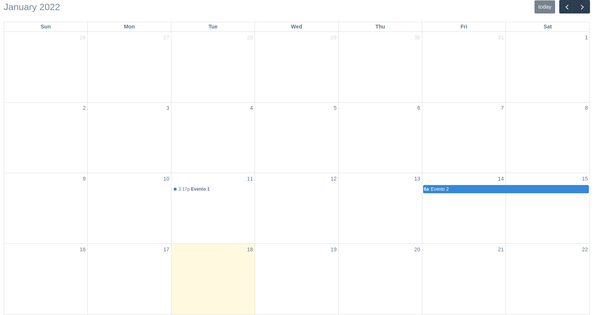

Calendar Widget
^^^^^^^^^^^^^^^^^^^

Calendar widget to display and interact with events.

.. note:: This widget is ReadOnly so no data input is send on form submit.

The widget has these three parameters:

- **attrs**: Dict withe the attributes of the HTML element of the widget.
- **calendar_attrs**: Dict with the settings the calendar object.
- **events**: Queryset or dict with the events data to render in the calendar.

--------------------
Usage in forms.py
--------------------

In model based form:

.. code:: python

    from djgentelella.widgets.calendar import CalendarInput
    from djgentelella.forms.forms import GTForm
    class PeopleLineForm(GTForm, forms.ModelForm):
        calendar = forms.CharField(
            widget=CalendarInput(
                required=False,
                calendar_attrs={'initialView': 'listWeek'},
                events=Event.objects.all()
            )
        )
        class Meta:
            model = models.MyModel
            fields = '__all__'

As noticed in above example, you can create a model with the event fields and pass a
queryset as the **events** parameter.
Also, you need to set the required=False for the Field because the widget handle its data internally.

In the future, the calendar will be able to return a list of events on form submit.

All the calendar settings and events API can be found in https://fullcalendar.io/docs