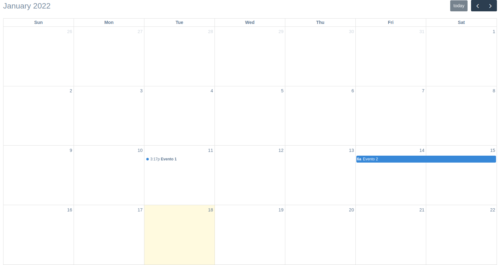

Calendar Widget
^^^^^^^^^^^^^^^^^^^

``CalendarInput`` renders a `FullCalendar <https://fullcalendar.io/>`_ month
view from a hidden text field. On its own it is read-only display: pass
``events`` and it shows them, nothing is submitted with the form. Set
``add_url``/``update_url``/``delete_url`` and it becomes interactive --
clicking a day or an event opens a Bootstrap modal to create, edit or delete,
each backed by a small AJAX endpoint you write.

Loading the static files
""""""""""""""""""""""""""""""""

FullCalendar ships in the *readonly* bundle, enabled with the
``use_readonlywidgets`` define::

    DEFAULT_JS_IMPORTS = {
        'use_readonlywidgets': True,
    }

.. note::

   The widget is initialised from ``gentelella/js/base.js``, which is
   generated and not shipped in the repository. Run
   ``python manage.py createbasejs`` after installing or upgrading, or the
   calendar silently never renders.

Read-only display
""""""""""""""""""""""""""""""""

.. code:: python

    from django import forms
    from djgentelella.forms.forms import GTForm
    from djgentelella.widgets.calendar import CalendarInput

    class CalendarForm(GTForm, forms.Form):
        calendar = forms.CharField(
            widget=CalendarInput(
                calendar_attrs={'initialView': 'listWeek'},
                events=Event.objects.all().values('title', 'start', 'end'),
            )
        )

``events`` is a list of FullCalendar event dicts, or a zero-arg callable
returning one (evaluated at render time, so it always reflects the current
queryset rather than whatever it was when the process started). Every dict is
validated by :class:`~djgentelella.serializers.calendar.EventSerializer` --
which only knows FullCalendar's own event fields (``title``, ``start``,
``end``, ``color``, ``backgroundColor``, ``borderColor``, ``allDay``, ...) --
so an unrecognized key, or ``None`` for a field the serializer doesn't mark
``allow_null``, raises a ``ValidationError`` for the *whole* list. A custom
field like ``description`` has to travel nested under ``extendedProps``
instead:

.. code:: python

    def get_events():
        return [
            {'id': str(e.pk), 'title': e.title, 'start': e.start,
             'color': e.color,
             **({'extendedProps': {'description': e.description}}
                if e.description else {})}
            for e in Event.objects.all()
        ]

All the calendar settings and the event object shape are documented at
https://fullcalendar.io/docs.

Creating, editing and deleting events
""""""""""""""""""""""""""""""""""""""""""""""""

.. code:: python

    from django.urls import reverse_lazy

    calendar = forms.CharField(
        widget=CalendarInput(
            events=get_events,
            add_url=reverse_lazy('event-create'),
            update_url=reverse_lazy('event-update'),
            delete_url=reverse_lazy('event-delete'),
        )
    )

Each is independent -- add without delete is fine. All three POST with the
``X-CSRFToken`` header, the same pattern as the rest of the library's AJAX
widgets:

- **add_url**: clicking an empty day opens a title/date/time/color/
  description modal and POSTs ``title``, ``start`` (``"YYYY-MM-DDTHH:MM"``),
  ``color``, ``description``. The view creates the event and answers with an
  object FullCalendar understands -- ``{"id", "title", "start", "color",
  "description"}`` -- which is added to the calendar without a reload.
- **update_url**/**delete_url**: clicking an existing event opens the same
  modal pre-filled, editable when ``update_url`` is set. Save POSTs ``id``
  plus the same fields as add; a Delete button (rendered only when
  ``delete_url`` is set) POSTs ``id``. Both apply straight to the calendar's
  in-memory event -- no reload either.

Without any of the three, clicking an event still opens the modal, just as a
read-only detail popover.

A minimal view for all three, mirroring the demo
(``demoapp/calendar/views.py``):

.. code:: python

    from datetime import datetime, time
    from django.http import JsonResponse
    from django.shortcuts import get_object_or_404
    from django.utils import timezone
    from django.utils.dateparse import parse_date, parse_datetime
    from django.views.decorators.http import require_POST

    def _parse_start(start_raw):
        start = parse_datetime(start_raw)
        if start is None:
            d = parse_date(start_raw)
            start = datetime.combine(d, time.min) if d else None
        if start is not None and timezone.is_naive(start):
            start = timezone.make_aware(start)
        return start

    def _event_json(event):
        return {'id': str(event.pk), 'title': event.title,
                'start': event.start.isoformat(), 'color': event.color,
                'description': event.description}

    @require_POST
    def event_create(request):
        start = _parse_start(request.POST.get('start'))
        if not request.POST.get('title') or start is None:
            return JsonResponse({'error': 'invalid'}, status=400)
        event = Event.objects.create(
            title=request.POST['title'], start=start,
            color=request.POST.get('color') or None,
            description=request.POST.get('description') or None)
        return JsonResponse(_event_json(event))

``event_update``/``event_delete`` follow the same shape --
``get_object_or_404(Event, pk=request.POST.get('id'))``, then save or delete.

**Widget options**

.. list-table::
   :header-rows: 1
   :widths: 20 15 65

   * - Option
     - Default
     - Description
   * - ``events``
     - ``None``
     - List of FullCalendar event dicts, or a zero-arg callable returning one.
   * - ``calendar_attrs``
     - ``None``
     - Extra options merged into the FullCalendar ``Calendar`` constructor
       (view, locale, ``dayMaxEvents``, ...).
   * - ``add_url``
     - ``None``
     - URL to POST new events to. Omit to keep the calendar read-only.
   * - ``update_url``
     - ``None``
     - URL to POST an edited event's ``id``/``title``/``start``/``color``/
       ``description`` to.
   * - ``delete_url``
     - ``None``
     - URL to POST an event's ``id`` to for deletion.

.. note::

   ``add_url``/``update_url``/``delete_url`` are commonly a ``reverse_lazy()``
   proxy. Check truthiness with ``is not None``, not ``if add_url:``, if you
   ever touch the widget's ``__init__`` -- these are typically instantiated in
   a ``ModelForm.Meta.widgets`` dict, which runs at class-body/import time.
   Forcing a lazy URL there resolves it before ``urls.py`` has finished
   building its own patterns, a circular import that only shows up once the
   view the URL points at is defined further down the same urlconf.

Day cells cap their own height and scroll once they have more events than fit
(``max-height`` + ``overflow-y: auto``, scoped to the widget's own container
id so it never reaches a second calendar on the same page). A long event
title is clipped with an ellipsis rather than overflowing the cell; hovering
an event with a description shows it as a Bootstrap tooltip -- the day cell
itself never displays it, keeping the month view compact.
