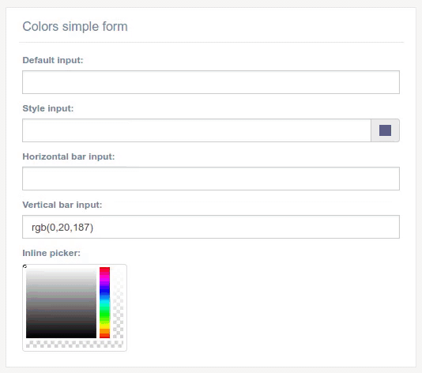

Color widget
^^^^^^^^^^^^^^^^^^^

How to implement it??

After add 'djgentelella' to INSTALLED_APPS variable in the settings file, you will be able to use this widget.

You can add this widget in the input field of a form in the following way:

.. code:: python

   from djgentelella.widgets.color import StyleColorInput, DefaultColorInput, HorizontalBarColorInput, VerticalBarColorInput, InlinePickerColor
   from djgentelella.forms.forms import GTForm
   class ColorWidgetsForm(GTForm, forms.ModelForm):
       defaultColorInput = forms.CharField(widget=DefaultColorInput)
       styleColorInput = forms.CharField(widget=StyleColorInput(attrs={"value": "#0014bb", "id": "c2"}))

       class Meta:
           model = Colors
           fields = "__all__"
           widgets = {
               "horizontalBarColorInput": HorizontalBarColorInput,
               "verticalBarColorInput": VerticalBarColorInput(attrs={"value": "#0014bb", "id": "c4"}),
           }

As you can see, you can pass default attributes in attrs kwarg param of the function like value and id.
The color can be remembered after refresh the page.

Exist four types of color widget: **DefaultColorInput, StyleColorInput, HorizontalBarColorInput, VerticalBarColorInput**

