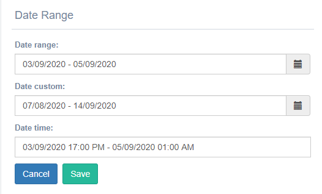
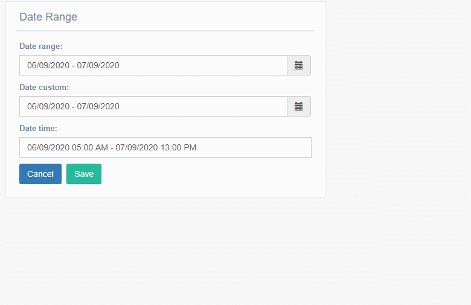

DateRange widget
^^^^^^^^^^^^^^^^^^^

 

It is a calendar to select range between dates .
You can uses this widget in a * CharField * and * TextField *

.. code:: python

    from djgentelella.widgets import core as widget
    from djgentelella.forms.forms import GTForm
    from demoapp import models
    class DateRangeForms(forms.ModelForm, GTForm):
        class Meta:
            model = models.yourmodel
            fields = '__all__'
            widgets = {
                'date_range': widget.DateRangeInput,
                'date_range_custom': widget.DateRangeInputCustom,
                'date_time': widget.DateRangeTimeInput,
            }

Exist three types of daterange widget: **DateRangeInput, DateRangeInputCustom, DateRangeTimeInput**

*DateRangeInput*: To select the dates you need to click on the field and then the calendars appear and when choosing the dates click on apply.

*DateRangeTimeInput*: The only thing differences about DateRangeInput is this widget lets add time.

*DateRangeInputCustom*: this widget contains six options to choose from(Last 7 days, Next Week, Last 30 days, This month, Last month and Custom Range)
Note: When you use custom range option of DateRangeInputCustom with need select the days similar to DateRangeInput 

