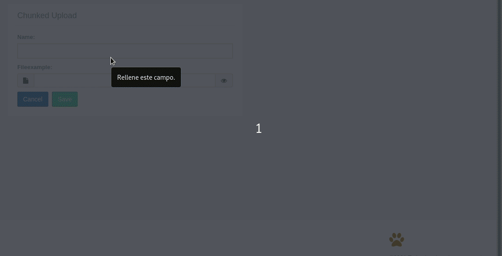

File Upload Widgets
^^^^^^^^^^^^^^^^^^^^^

Widgets for handling file uploads, including standard uploads, chunked uploads for large files, and media recording.

-----------------
FileInput
-----------------

A styled file input with chunked upload support for handling files of any size.

.. code:: python

    from djgentelella.widgets import core as genwidgets
    from djgentelella.forms.forms import GTForm

    class DocumentForm(GTForm, forms.ModelForm):
        class Meta:
            model = Document
            fields = ['name', 'file']
            widgets = {
                'name': genwidgets.TextInput,
                'file': genwidgets.FileInput,
            }

The FileInput widget automatically handles chunked uploads using the built-in upload endpoints.

------------------
ClearableFileInput
------------------

A file input that shows the current file and provides a checkbox to clear it.

.. code:: python

    from djgentelella.widgets import core as genwidgets

    class ProfileForm(GTForm, forms.ModelForm):
        class Meta:
            model = Profile
            fields = ['name', 'avatar']
            widgets = {
                'name': genwidgets.TextInput,
                'avatar': genwidgets.ClearableFileInput,
            }

-----------------
FileChunkedUpload
-----------------

A specialized widget for uploading large files with progress tracking and resume capability.

**Setup Required:**

1. Install the chunked upload URLs in your project:

.. code:: python

    # urls.py
    from djgentelella.urls import urlpatterns as djgentelellaurls

    urlpatterns = djgentelellaurls + [
        # your urls...
    ]

2. Run migrations to create the ChunkedUpload model:

.. code:: bash

    python manage.py migrate

**Usage:**

.. code:: python

    from djgentelella.widgets.files import FileChunkedUpload
    from djgentelella.forms.forms import GTForm

    class LargeFileForm(GTForm, forms.ModelForm):
        class Meta:
            model = LargeFile
            fields = ['name', 'file']
            widgets = {
                'name': genwidgets.TextInput,
                'file': FileChunkedUpload,
            }

    # Or as a standalone field
    class UploadForm(GTForm, forms.Form):
        document = forms.FileField(
            widget=FileChunkedUpload,
            required=False
        )

The widget handles:

- Large file uploads by splitting into chunks
- Upload progress indication
- Automatic retry on network errors
- Cleanup of temporary files after completion

----------------------------
Media Recording Widgets
----------------------------

These widgets allow users to record media directly from their device's camera or microphone.

ImageRecordInput
""""""""""""""""

Capture images using the device camera.

.. code:: python

    from djgentelella.widgets import core as genwidgets
    from djgentelella.forms.forms import GTForm

    class PhotoForm(GTForm, forms.Form):
        photo = forms.FileField(
            widget=genwidgets.ImageRecordInput,
            label='Take a photo'
        )

        # With custom preview dimensions
        profile_photo = forms.FileField(
            widget=genwidgets.ImageRecordInput(attrs={
                'data-width': '200px',
                'data-height': '200px'
            }),
            label='Profile Photo'
        )

VideoRecordInput
""""""""""""""""

Record video using the device camera.

.. code:: python

    from djgentelella.widgets import core as genwidgets

    class VideoForm(GTForm, forms.Form):
        video = forms.FileField(
            widget=genwidgets.VideoRecordInput,
            label='Record a video'
        )

        # With custom preview dimensions
        presentation = forms.FileField(
            widget=genwidgets.VideoRecordInput(attrs={
                'data-width': '640px',
                'data-height': '480px'
            }),
            label='Record Presentation'
        )

.. note:: Video size depends on the camera's default configuration.

AudioRecordInput
""""""""""""""""

Record audio using the device microphone.

.. code:: python

    from djgentelella.widgets import core as genwidgets

    class AudioForm(GTForm, forms.Form):
        audio = forms.FileField(
            widget=genwidgets.AudioRecordInput,
            label='Record audio message'
        )

        voice_note = forms.FileField(
            widget=genwidgets.AudioRecordInput,
            label='Voice Note',
            required=False
        )

---------------------------------
Complete Media Upload Example
---------------------------------

A form combining different file and media upload widgets:

.. code:: python

    from django import forms
    from djgentelella.widgets import core as genwidgets
    from djgentelella.widgets.files import FileChunkedUpload
    from djgentelella.forms.forms import GTForm

    class MediaUploadForm(GTForm, forms.Form):
        # Standard file upload
        document = forms.FileField(
            widget=genwidgets.FileInput,
            label='Upload Document'
        )

        # Large file with chunked upload
        large_file = forms.FileField(
            widget=FileChunkedUpload,
            label='Upload Large File',
            required=False
        )

        # Camera photo capture
        photo = forms.FileField(
            widget=genwidgets.ImageRecordInput(attrs={
                'data-width': '320px',
                'data-height': '240px'
            }),
            label='Take Photo',
            required=False
        )

        # Video recording
        video = forms.FileField(
            widget=genwidgets.VideoRecordInput(attrs={
                'data-width': '640px',
                'data-height': '480px'
            }),
            label='Record Video',
            required=False
        )

        # Audio recording
        audio = forms.FileField(
            widget=genwidgets.AudioRecordInput,
            label='Record Audio',
            required=False
        )

---------------------------------
Handling Uploaded Files
---------------------------------

In your view, handle the uploaded files as you would with standard Django file uploads:

.. code:: python

    def upload_view(request):
        if request.method == 'POST':
            form = MediaUploadForm(request.POST, request.FILES)
            if form.is_valid():
                # Access uploaded files
                document = form.cleaned_data['document']
                photo = form.cleaned_data.get('photo')
                video = form.cleaned_data.get('video')
                audio = form.cleaned_data.get('audio')

                # Save files as needed
                if document:
                    handle_uploaded_file(document)

                return redirect('success')
        else:
            form = MediaUploadForm()

        return render(request, 'upload.html', {'form': form})

.. note::

    Media recording widgets require:

    - HTTPS connection (browsers require secure context for camera/microphone access)
    - User permission to access camera/microphone
    - Modern browser with MediaRecorder API support
