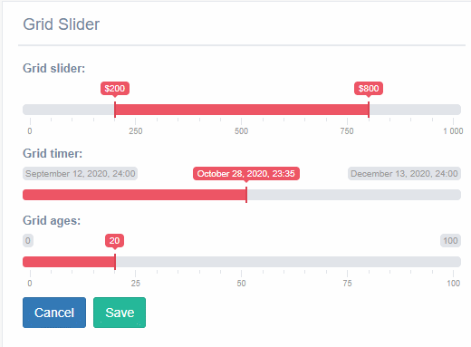

Usage of GridSlider, DateGridSlider and SingleGridSlider Widgets
^^^^^^^^^^^^^^^^^^^^^^^^^^^^^^^^^^^^^^^^^^^^^^^^^^^^^^^^^^^^^^^^^^^^^^^^^^^^
.. image:: ../_static/GridSlider.png

*GridSlider*
It is similar to range input, but this use two pointer represent the min and max value. 

*SingleGridSlider*
It is similar to *GridSlider*, but this only can use a pointer. 

*DateGridSlider*
It is similar to *SingleGridSlider*, but this only receive values type date in format('yyyy/mm/dd'). 

You can uses this widget in a * CharField *, * IntegerField * and *DateTime*

---------------
How to used it?
---------------

You need add in the widget a list with especifics atributes.

In the GridSlider need to add:
 - data-min: this atribute receives the min value,in addition can be use with values type integer.
 - data-max: this atribute receives the max value,in addition can be use with values type integer.
 - data-step: this atribute receives the step value requerid to reach the maximum or minimum value.
 - data-grid: this atribute receive true or false value, if the value is true it show a grid under the bar with some step values, but the value is false don't appear the grid.  
 - data-to_max: this atribute defined the default min value and receive integer or date values. 
 - data-from_min:This defined the default max value and receive integer or date values.
 - data-from_fixed: this atribute receive true or false value, it function is limit the minimun value for the slider dont move to more that *data_to_min* atribute.
 - data-to_fixed:this atribute receive true or false value, it function is limit the maximum value for the slider dont move more that *data_to_max* atribute
 - data-prefix: This receive the simbols can use to represent money example: *$* and *€*.
 - data-hide_min_max:this atribute receive true or false value, it function is appear labels with the min a max value.
 - data-target_from: this receive the name of one field of the model and that field represent the minimum value of the grid slider. 
 - data-target_to::this receive the name of one field of the model and that field represent the maximum value of the grid slider.

About the DateGridSlider need to add:
 - data-min: this atribute receives the min value,in addition can be use with values type date in format ('YYYY / MM / DD').
 - data-max: this atribute receives the max value,in addition can be use with values type date in format ('YYYY / MM / DD').
 - data_from: This defined the default initial value and only date values.

About the SingleGridSlider need to add:
 - data-min: this atribute receives the min value,in addition can be use with values type date in format ('YYYY / MM / DD').
 - data-max: this atribute receives the max value,in addition can be use with values type date in format ('YYYY / MM / DD').
 - data_from: This defined the default initial value and only date values.
 - data-target: this receive the name of one field of the model and that field represent the minimum value of the grid slider. 
 - data-target_from: this atribute receive simbols. 

-----------------
Forms.py
-----------------

In model based form:

.. code-block:: python

    class gridSliderForm(forms.ModelForm, GTForm):
    grid_slider = forms.CharField(widget=widget.GridSlider(attrs={'data-min': '0',
                                                                  'data-max': '1000',
                                                                  'data-step': 2,
                                                                  'data-grid': 'true',
                                                                  'data-from_fixed': 'false',
                                                                  'data-prefix': "$",
                                                                  'data-to_fixed': 'false',
                                                                  'data-to_max': 750,
                                                                  'data-from_min': 200,
                                                                  'data-hide_min_max': 'true',
                                                                  'data-target-from': 'minimum',
                                                                  'data-target-to': 'maximum',
                                                                  })
    grid_timer = forms.CharField(widget=widget.DateGridSlider(attrs={'data_min': '2020-09-12',
                                                                        'data_max': '2020-12-12',
                                                                        'data_from': '2020-11-12',
                                                                        }))
    
    grid_ages = forms.CharField(widget=widget.SingleGridSlider(attrs={'data-min': '0',
                                                                      'data-max': '100',
                                                                      'data_from': '20',
                                                                      'data-prefix': ' ',
                                                                      'data-target': 'age',
                                                                      }))

    class Meta:
        model = models.gridSlider
        fields = '__all__'
        widgets = {
            'minimum': widget.HiddenInput,
            'maximum': widget.HiddenInput,
            'datetime': widget.HiddenInput,
            'age': widget.HiddenInput
        }

As you can see in the previous code you can make the fields of the model can be hidden or any type.