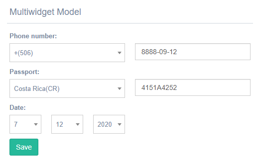

Multiwidgets
^^^^^^^^^^^^

This widget combinate various widgets to create one for specific functionality, all data are saved separated by comma and point.

.. image:: ../_static/Multiwidget.git

---------
SplitDate
---------
It is a kind of date value selector that contains three selectors: the first is for days, the second for months, and the last for years.
You can use this widget in a *DateField*, *CharField*. 

--------------
PassportWidget
--------------
This widget contains two widgets one is selector with countrie and the second for insert the digits of passport, the data is separate with comma.
You can use only in a **CharField**.

----------------------
PhoneNumberMultiwidget
----------------------
This widget is similar of PassportWidget the difference is that the first widget contains only the codes numbers for contries
You can use only in a **CharField**

.. code:: python

    from djgentelella.forms.forms import GTForm
    from djgentelella.widgets import multiwidgets as widget

    class MultiwidgetForm(forms.ModelForm, GTForm):

        class Meta:
            model = models.Multiwidget
            fields = '__all__'
            widgets = {
                'phone_number': widget.PhoneNumberMultiWidget,       
                'passport':widget.PassportWidget,
                'date':widget.SplitDate
                }

