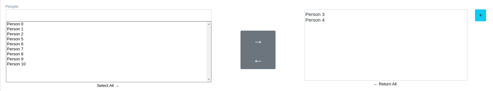

Select2Box Widget
^^^^^^^^^^^^^^^^^^

2 requirements must be achieved to use these widget

- Create a lookup channel in ``app/gtselects.py`` based in the model we want to use as options in the widget.
- Replace default widget in form with ``Select2Box``.

--------------------------------------
Defining Lookups for usage in widgets
--------------------------------------
An example on how a lookup must be defined:

.. code:: python

    from djgentelella.groute import register_lookups
    from djgentelella.views.select2autocomplete import BaseSelect2View
    from yourapp.models import models

    @register_lookups(prefix="person", basename="personbasename")
    class PersonGModelLookup(BaseSelect2View):
        model = models.Person
        fields = ['name']

Based in above example we need:

- A decorator named register_lookups defined above the lookup class that receives two parameters:
    - A prefix, which is basically the model name in lowcaps
    - A basename, which is a meaningful name that will help you differentiate between multiple lookups
- A class that inherits from the custom class BaseSelect2View which is responsible of creating an url that exposes the model data in a way the widget understands it, so to make it work the class needs:
    - A model to work with.
    - A list of fields from the model that the inherited class will use as filtering options when returning data to the widget.

If a more customized class is desired the next options can be overwritten to achieve it:

 - ref_field: can be used to select a specific field from the model with a list behavior (manytomanyfield or fields with choices) and use it to filter options.
 - ref_name: combined with ref_field, this field receives a list of strings that will be evaluated if any of its elements is contained in the ref_field field.
 - text_separator:  if provided, the class will use it to generate a list separated with the given value from result data.
 - text_wrapper: if provided, the class will wrap each element of the result query with the value given.
 - order_by: if provided, the class will used the given field to order the result query, the default field is the model pk.

------------------------
Usage with API in forms
------------------------

In model based form:

.. code:: python

    from djgentelella.widgets.core import Select2Box
    from djgentelella.widgets.selects import AutocompleteSelect
    from djgentelella.forms.forms import GTForm
    class PeopleSelect2BoxForm(GTForm, forms.ModelForm):
        class Meta:
            model = PeopleGroup
            fields = '__all__'
            widgets = {
                'name': TextInput,
                'people': Select2Box(attrs={'data-url':reverse_lazy('personbasename-list')}),
                'comunities': Select2Box(attrs={'data-url':reverse_lazy('comunitybasename-list')}),
                'country': AutocompleteSelect('countrybasename')
            }

As noticed in above example, the last steps are:
 - You can use it with a MultipleChoice field, where you just need to set the widget to ``Select2Box``, and is ready for use.
 - If you want data from an API, send the basename we provided in the lookup class decorator as the attribute ``data-url`` (see previous example) to the widget and it's ready for usage with an API.

---------------------------
Usage without API in forms
---------------------------

.. code:: python

    class dataOptions(GTForm):
        mydata = forms.MultipleChoiceField(widget=Select2Box, choices=[[1, "primero"], [2, "segundo"], [3, "tercero"]])

As noticed in above example, the last steps are:
 - You can use it with a MultipleChoice field, where you just need to set the widget to ``Select2Box``, and is ready for use.

----------------------------------------
Create new data for the select elements
----------------------------------------

If you want to create new elements, you must create a view that can process data, with ``GET`` and ``POST`` requests.

.. code:: python

    def Select2BoxPersonAddView(request):
    form_t = PersonForm(prefix='person_new_data')
    if request.method == "GET":
        render_str = render_to_string('gentelella/widgets/select2box_modal_body.html', {'form': form_t})
        return JsonResponse({'result': render_str})
    elif request.method == "POST":
        json_data = json.loads(request.body)
        review_data = PersonForm(json_data, prefix='person_new_data')
        if review_data.is_valid():
            try:
                saved_data = review_data.save()
                return JsonResponse({'result': {'id': saved_data.id, 'text': saved_data.name, 'selected': False, 'disabled': False}})
            except (KeyError, PersonForm.errors):
                return JsonResponse({'error': 'Error'})

As shown in the previous example, for the creation these are the steps:
 - The view must have a form to send and save data.
 - Define a form variable, that contains a model form.
 - If there are same widgets in the general form and in the model form, a prefix must be declared due to a name (as shown in the above example), to avoid functionality issues.
 - If the request is a ``GET`` method, the data of the form must be rendered to string, and sent as a JsonResponse.
 - If the request is a ``POST`` method, the data must be validated with the django ``is_valid`` functionality an saved to the model, preventing data loss and corruption.
 - The ``POST`` method returns a JSON with the saved data id, text, selected, disabled.

For the form configuration, you must declare ``data-addurl``:

.. code:: python

    class PeopleSelect2BoxForm(GTForm, forms.ModelForm):
        class Meta:
            model = PeopleGroup
            fields = '__all__'
            widgets = {
                'name': TextInput,
                'people': Select2Box(attrs={'data-url':reverse_lazy('personbasename-list'), 'data-addurl':reverse_lazy('select2box-group-personform')}),
                'comunities': Select2Box(attrs={'data-url':reverse_lazy('comunitybasename-list'), 'data-addurl':reverse_lazy('select2box-group-comunityform')}),
                'country': AutocompleteSelect('countrybasename')
            }

As seen in the previous example, ``addurl`` references the view where the form is processed.
