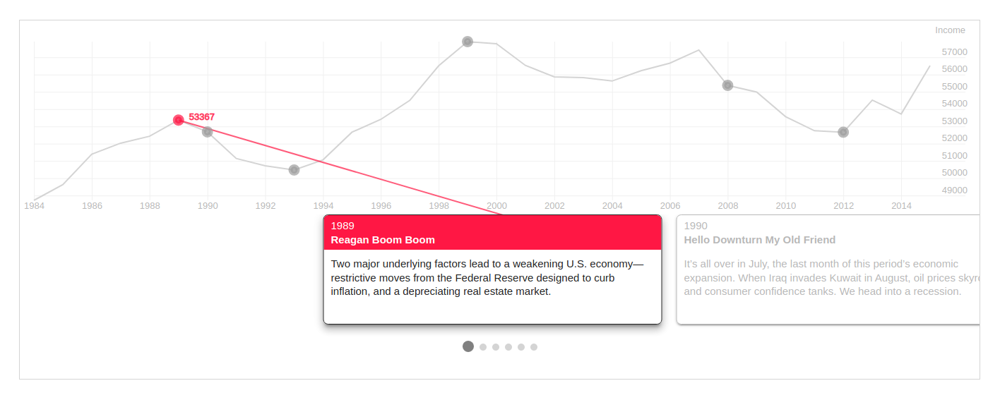

Storyline Widget
^^^^^^^^^^^^^^^^^^^

.. note:: This widget is ReadOnly so no data input is send on form submit.

2 requirements must be achieved to use these widgets

- Create a lookup channel in ``app/gtstoryline.py`` based in the model we want to use as options in the widget.
- Replace default widget in form with ``UrlStoryLineInput``.

-------------------------------------
Defining Lookups for usage in widgets
-------------------------------------
An example on how a lookup must be defined:

.. code:: python

    import datetime
    from djgentelella.groute import register_lookups
    from djgentelella.views.storyline import StorylineBuilder

    @register_lookups(prefix="storyline", basename="examplestoryline")
    class StorylineExample(StorylineBuilder):

        def create_options(self):
            pass
        def create_csv(self):
            return []

Based in above example we need:

- A decorator named register_lookups defined above the lookup class that receives two parameters:
    - A prefix, which is basically the model name in lowcaps
    - A basename, which is a meaningful name that will help you differentiate between multiple lookups
- A class that inherits from the custom class StorylineBuilder which is responsible of creating an url that exposes the model data in a way the widget urderstands it, so to make it works the class needs to overwrite the methods.

--------------------------------------
Details on the methods override:
--------------------------------------

- Create options: This method should return a dictionary containing the storyline settings, with the following characteristics:
    - a "data" dictionary containing three obligatory fields:
        - datetime_column_name: a case and space sensitive string that is the value in the first row of the column containing the dates for the X-coordinates of the chart.
        - datetime_format: a string that tells StorylineJS how to interpret the value in your datetime_column. The format should be as specified with [`d3-time-format`](https://github.com/d3/d3-time-format/blob/master/README.md#locale_format)
        - data_column_name: a a case and space sensitive string that is the value in the first row of the column of your file which has the values to be used for the Y-coordinates of the chart.

    - a "chart" object with the following keys:
        - datetime_format: a string telling StorylineJS how to display dates, used mostly for the X-axis labels, but also used for cards if no display_date is specified. The format should be as specified with [`d3-time-format`](https://github.com/d3/d3-time-format/blob/master/README.md#locale_format)
        - y_axis_label *(optional)*: Use this to indicate the units for the Y values in your chart. If this is left out, then `data.data_column_name` will be used.

    - a "slider" dictionary that contains the following attributes:
        - start_at_card: A string defining at which card you want the slider to be positioned when first rendered,
        - title_column_name: The exact title of the column with the titles information,
        - text_column_name: The exact name of the column with the texts information,

- Create csv: this method should return a list of strings, where the first string contains the datetime-column name, the data-column name, the title column name and the text column name (they should match with the information assigned in the options object.
    - CSV format should be separated by commas, and the quantity of columns of the data cannot surpass the columns in the header row (the first one)
    - It could have less columns than the header, nonetheless needs at least the first two, containing datetime and data information, otherwise will fail.

--------------------
Usage in forms.py
--------------------

In model based form:

.. code:: python

    from djgentelella.widgets.storyline import UrlStoryLineInput
    from djgentelella.forms.forms import GTForm
    from django.urls import reverse_lazy
    class PeopleLineForm(GTForm, forms.ModelForm):
        storyline = forms.CharField(widget=UrlStoryLineInput(
                attrs={"data-url": reverse_lazy('examplestoryline-list'),
                        "height: 500, "width": 600",
                         "data-url_name": 'examplestoryline'
                }))
        class Meta:
            model = models.MyModel
            fields = '__all__'

As noticed in above example, the last steps are:
 - Create a CharField with widget as UrlStoryLineInput add data-url including the basename plus -list.
 - It is mandatory to also send "height" and "width" in the attributes, as well as a "data-url_name" field with the exact basename. (used internally to redirection).

You can set initial data with form(initial={}) changing the data-url attribute when value is not None on the field.

In the example ``data-url_name`` the prefix ``data-`` is used to indicate data Html element, and ``url_name`` is the attribute name.
