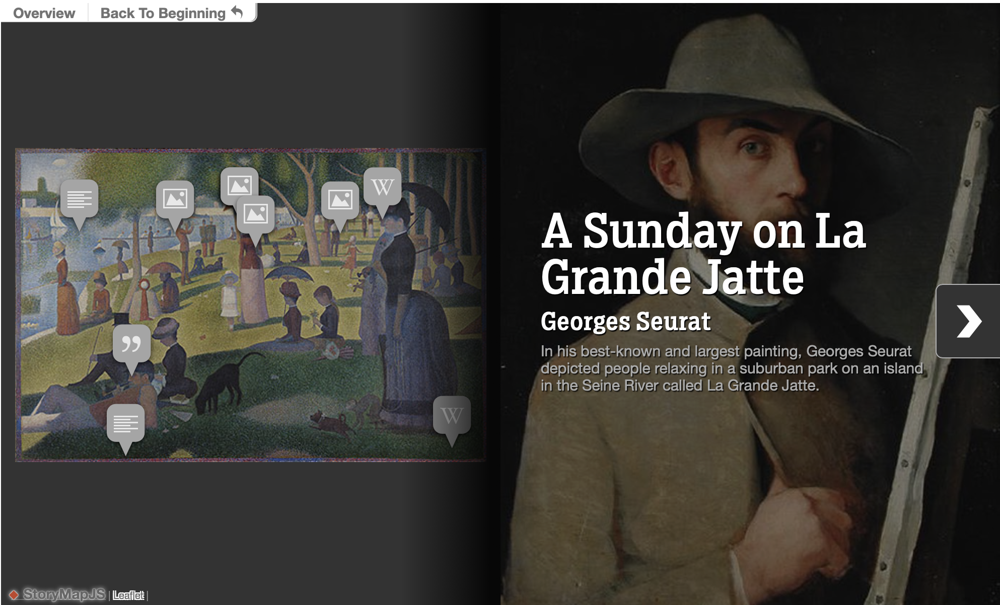

StoryMaps Widgets
^^^^^^^^^^^^^^^^^^^
There are 2 diferent storymap types:

Giga-Pixel StoryMap

.. note:: This widget is ReadOnly so no data input is send on form submit.

You must have to:

- Create a lookup channel in ``app/gtstorymap.py`` based in the model we want to use as options in the widget.
- Replace default widget in form with ``GigaPixelStoryMapInput``.

Map-Based StoryMap

.. image:: ../_static/storymapmb.png

.. note:: This widget is ReadOnly so no data input is send on form submit.

You must have to:

- Create a lookup channel in ``app/gtstorymap.py`` based in the model we want to use as options in the widget.
- Replace default widget in form with ``MapBasedStoryMapInput``.

--------------------
Usage in forms.py
--------------------

In model based form:

.. code:: python

    from djgentelella.widgets.storymap import GigaPixelStoryMapInput
    from djgentelella.forms.forms import GTForm
    from django.urls import reverse_lazy
    class ExampleForm(GTForm, forms.ModelForm):
        timeline = forms.CharField(widget=GigaPixelStoryMapInput(
                attrs={"data-url": reverse_lazy('examplestorymapgp-list'),
                    "storymap_options": gigapixel_storymap_options
                }), required=False)
        class Meta:
            model = models.MyModel
            fields = '__all__'

As noticed in above example, the last steps are:
 - Create a CharField with widget as GigaPixelStoryMapInput add data-url including the basename plus -list.
 - Se field as required = False

You can set initial data with form(initial={}) changing the data-url attribute when value is not None on the field.

More see: https://storymap.knightlab.com/advanced/#json-syntax
