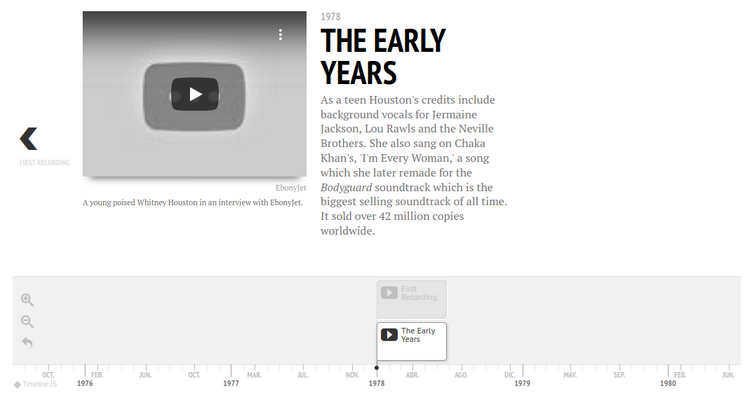

TimeLine Widget
^^^^^^^^^^^^^^^^^^^

.. note:: This widget is ReadOnly so no data input is send on form submit.

2 requirements must be achieved to use these widgets

- Create a lookup channel in ``app/gttimeline.py`` based in the model we want to use as options in the widget.
- Replace default widget in form with ``UrlTimeLineInput``.

-------------------------------------
Defining Lookups for usage in widgets
-------------------------------------
An example on how a lookup must be defined:

.. code:: python

    import datetime
    from djgentelella.groute import register_lookups
    from djgentelella.views.timeline import BaseTimelineView

    @register_lookups(prefix="timeline", basename="exampletimeline")
    class TimelineExample(BaseTimelineView):
        def get_title(self):
            pass
        def get_events(self):
            return []
        def get_scale(self):
            return 'human'
        def get_eras(self):
            return []

Based in above example we need:

- A decorator named register_lookups defined above the lookup class that receives two parameters:
    - A prefix, which is basically the model name in lowcaps
    - A basename, which is a meaningful name that will help you differentiate between multiple lookups
- A class that inherits from the custom class BaseTimelineView which is responsible of creating an url that exposes the model data in a way the widget urderstands it, so to make it works the class needs overwrite the methods.

More see https://timeline.knightlab.com/docs/json-format.html#json-slide

--------------------
Usage in forms.py
--------------------

In model based form:

.. code:: python

    from djgentelella.widgets.timeline import UrlTimeLineInput
    from djgentelella.forms.forms import GTForm
    from django.urls import reverse_lazy
    class PeopleLineForm(GTForm, forms.ModelForm):
        timeline = forms.CharField(widget=UrlTimeLineInput(
                attrs={"data-url": reverse_lazy('exampletimeline-list'),
                        'style': "height: 500px;",
                         "data-option_language": 'es'
                }), required=False)
        class Meta:
            model = models.MyModel
            fields = '__all__'

As noticed in above example, the last steps are:
 - Create a CharField with widget as UrlTimeLineInput add data-url including the basename plus -list.
 - Se field as required = False

You can set initial data with form(initial={}) changing the data-url attribute when value is not None on the field.

--------------------------------------
Passing options to timelineJS3
--------------------------------------

You can pass timelineJS3 options using data attrs in widget attr parameter.
In the example ``data-option_language`` the prefix ``data-`` is used to indicate data Html element, the section ``option\_``  is used to indicate that this attribute is a
timeline option and ``language`` is the option name.

More see: https://timeline.knightlab.com/docs/options.html