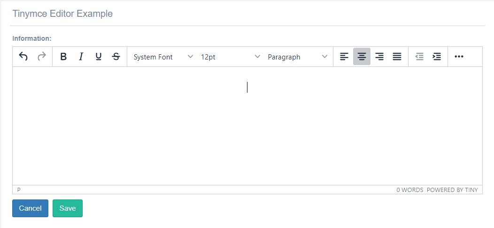

EditorTinymce widget
^^^^^^^^^^^^^^^^^^^^^^^

This widget approach used Tinymce-editor js for save in html format the information(text, images, link, tables, videos).
You can add this widget only in a *TextField*.

You need to add in the settings file a attribute with the name *Tinymce_UPLOAD_PATH* , this field contain a directory to save the upload files.

..code:: python

    TINYMCE_UPLOAD_PATH =os.path.join(MEDIA_ROOT, 'tinymce/')

Example for use the widget:

.. code:: python

   from djgentelella.forms.forms import GTForm
   from djgentelella.widgets import tinymce as widget

    class EditorTinymce(forms.ModelForm,GTForm):

      class Meta():
        model=WysiwygModel
        fields='__all__'
        widgets={
          'information': widget.EditorTinymce,
        }

..note:: To Upload files in the server, you with need to login.
 Example to upload images:
 .. image:: ../_static/uploadImages.gif
