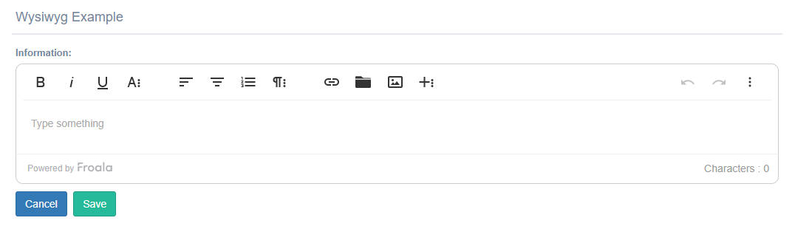

TextareaWysiwyg widget
^^^^^^^^^^^^^^^^^^^^^^^

This widget approach used summernote-editor js for save in html format the information.
You can add this widget only in a *TextField*.

You need to add in the settings file a attribute with the name *SUMMERNOTE_UPLOAD_PATH* , this field contain a directory to save the upload files.

..code:: python

    SUMMERNOTE_UPLOAD_PATH =os.path.join(MEDIA_ROOT, 'summernote')

Example for use the widget:

.. code:: python

    from djgentelella.forms.forms import GTForm
    from djgentelella.widgets import wysiwyg as widget

    class WysiwygForm(forms.ModelForm,GTForm):

      class Meta():
        model=WysiwygModel
        fields='__all__'
        widgets={
          'information': widget.TextareaWysiwyg,
        }

..note:: To Upload files in the server, you with need to login.
