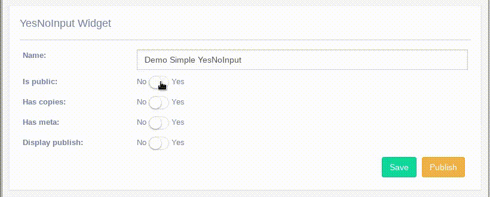
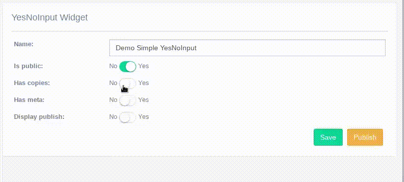
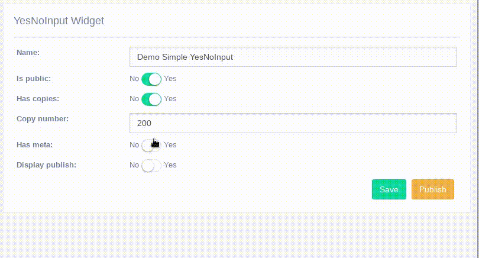
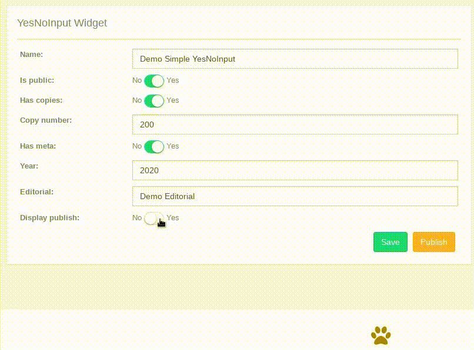

YesNoInput widget
^^^^^^^^^^^^^^^^^^^

This widget try to implement repetitive configurations in yes/no input options,
it can be integrated in its basic behavior with minimal configurations.

Simple YesNoInput
-----------------

The basic YesNoInput can be set in two ways:
 - The easiest in Meta
 - And creating a field in form.

In Meta class:

.. code:: python

    from djgentelella.widgets import core as genwidgets
    from djgentelella.forms.forms import GTForm
    from demoapp import models
    class YesNoInputForm(forms.ModelForm, GTForm):
        class Meta:
            model = models.yourmodel
            fields = '__all__'
            widgets = {
                'is_public': genwidgets.YesNoInput
            }

Make sure you model has the `is_public` field and djgentelella will be the dirty work.

As a Form field:

.. code:: python

    from djgentelella.widgets import core as genwidgets
    from djgentelella.forms.forms import GTForm
    from demoapp import models
    class YesNoInputForm(forms.ModelForm, GTForm):
        is_public = forms.BooleanField(widget=genwidgets.YesNoInput())
        class Meta:
            model = models.yourmodel
            fields = '__all__'

In this example is_public can be an extra field that is not related with the model class in Meta.

Related YesNoInput
-------------------

This feature can be used when you need to display another field dinamically when the YesNoInput change.

Because it has extra configurations you should declare it in the form as a field as the following example:

.. code:: python

    from djgentelella.widgets import core as genwidgets
    from djgentelella.forms.forms import GTForm
    from demoapp import models
    class YesNoInputForm(forms.ModelForm, GTForm):
        has_copies = forms.BooleanField(widget=genwidgets.YesNoInput(
            attrs={'rel': ['copy_number']}))
        class Meta:
            model = models.yourmodel
            fields = '__all__'

In **rel** you can pass an **id**, **field_name** or **class** which is the element or elements that will be show or hide depending of the YesNoInput state.

Multiple Related YesNoInput
----------------------------

This feature can be used when you need to display other fields dinamically when the YesNoInput change.

To this example we will use two ways to related input fields, using field_name and using the input id.

.. code:: python

    from djgentelella.widgets import core as genwidgets
    from djgentelella.forms.forms import GTForm
    from demoapp import models
    class YesNoInputForms(forms.ModelForm, GTForm):
        has_meta = forms.BooleanField(widget=genwidgets.YesNoInput(
            attrs={'rel': ['#id_year','editorial', '.other_elements']}))
        class Meta:
            model = models.yourmodel
            fields = '__all__'

As you can see here we define three rel types:
 - The element id 
 - the field_name which can be a field from your model.
 - and the elements class that we want to display/show.

External related elements with different shparent
--------------------------------------------------

This feature is helpful when you need to show or hide and specific information but is declared in the template, to do this you need to 
pass the the id of the external element and also you can pass the shparent that where it is wrapped.  

To this example we will use two ways to related input fields, using field_name and using the input id.

.. code:: python

    from djgentelella.widgets import core as genwidgets
    from djgentelella.forms.forms import GTForm
    from demoapp import models
    
    class YesNoInputForms(forms.ModelForm, GTForm):
        display_publish = forms.BooleanField(widget=genwidgets.YesNoInput(
            attrs={'rel': ['#display_publish_info']}, shparent='.x_panel'))
        class Meta:
            model = models.yourmodel
            fields = '__all__'

Your template is going to look like the following:

.. code:: django

    
        

            <h2>YesNoInput Widget</h2>
            

            

                <form method="post" action="">
                    
                    {{ form.as_horizontal }}
                    

                        <button class="btn btn-success" type="submit" name="savebtn" value="save"></button>
                        <button id="btn_from_template" class="btn btn-warning" type="submit" ></button>
                    

                </form>
            

        

        

            <h2>Extra publish form</h2>
            

            

                <h2 id="display_publish_info">Extra information to display when display publish is set</h2>
            

        

    

**id** is the external element that we wanted to show/hide.

**shparent** Is the container element that djgentelella will look for to hide the full content.

**shparent** is optional and if you don't pass it, djgentelella will look for a **.form-control** class to hide/show it, in that case make sure that your element is wrapped in an **form-control** element.